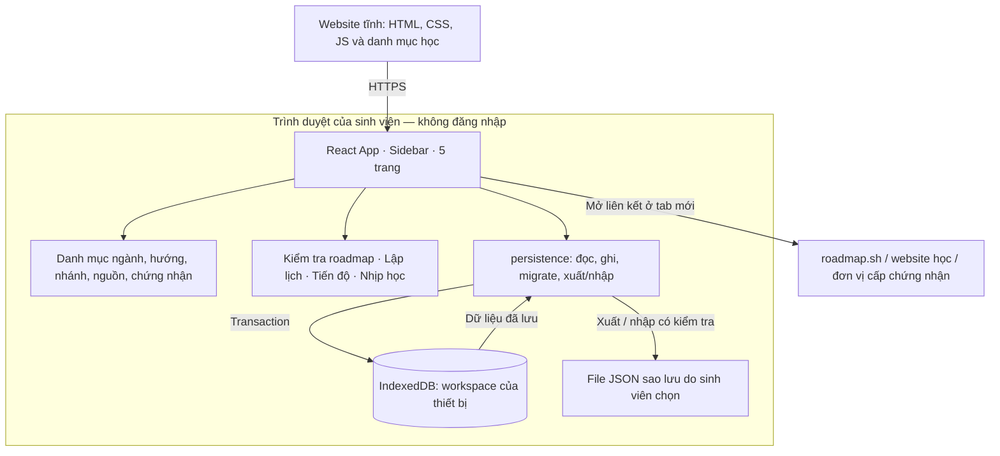
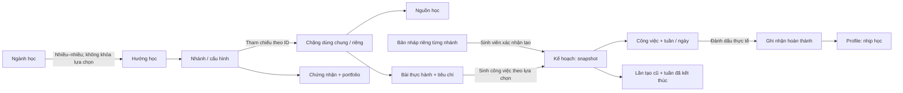
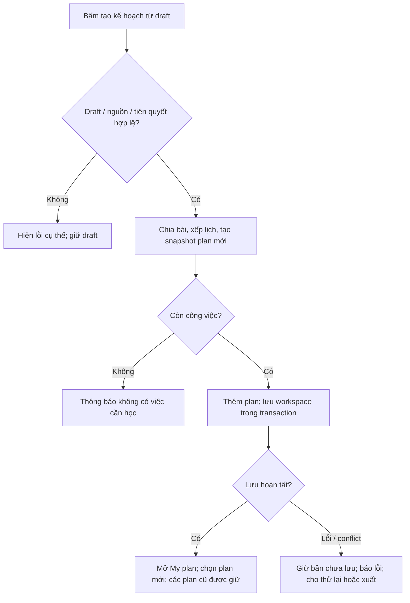

# MajorWeave — Kiến trúc triển khai để Hải duyệt

**Phiên bản:** 0.1 · **Ngày:** 04/10/2026 · **Bước:** 3 — kiến trúc, hợp đồng dữ liệu và mẫu chuẩn.

**Trạng thái:** Tài liệu đề xuất có mẫu dữ liệu đã kiểm tra cấu trúc. Chưa chuyển đổi ứng dụng đang chạy, chưa tạo backend/CSDL server. Phân công năm thành viên và bộ quy tắc Antigravity đầy đủ là bước sau khi Hải duyệt phần này.

## 1. Quyết định đang áp dụng

| Nội dung | Quyết định / căn cứ |
|---|---|
| Giao diện nền | Dùng bản cũ tại `/`, có sidebar; giữ `src/main.tsx`, `src/styles.css` làm tham chiếu. Hải: “Dùng bản cũ đi”, sau đó “Được rồi, làm bước tiếp theo đi”. |
| Đăng nhập hiện tại | Hải: “Trước mắt không đăng nhập đi”. Mọi luồng học chạy ở chế độ khách. |
| Profile | Hồ sơ học tập cục bộ: tên hiển thị, ngành, nhịp học. Không phải tài khoản online. |
| Tài khoản / Google | Phần mở rộng sau; chưa chọn nhà cung cấp hoặc thời điểm triển khai. Không đưa OAuth vào tiêu chí hoàn thành giai đoạn này. |
| Nhiều kế hoạch | Giữ quyết định đã chốt: có nhiều kế hoạch và chọn một kế hoạch đang xem. |
| Phạm vi học | Hoàn thiện mọi hướng/nhánh trong danh mục được duyệt trên 12 ngành. Bảng đích hiện đề xuất 18 hướng, 50 cấu hình; xem [bảng phạm vi](PHAM_VI_MAJORWEAVE.md). Không thu về ba nhánh Backend. |
| Notion | Chưa cập nhật. Tài liệu và lịch sử kỹ thuật nằm trong repo. |

Chọn lại giao diện cũ không hủy yêu cầu nhiều kế hoạch hoặc mọi hướng học. Nội dung mẫu của Prototype 02 không phải thư viện học đã hoàn thiện; bố cục ngang của nó không được dùng làm nền thiết kế.

## 2. Công nghệ và lý do

| Thành phần | Phương án cho giai đoạn không đăng nhập |
|---|---|
| Website | React + TypeScript + Vite đang có trong repo; giữ phiên bản khóa trong `package-lock.json` |
| Điều hướng | React Router / HashRouter đang dùng; năm trang chính giữ URL `#/explore`, `#/path`, `#/roadmap`, `#/plan`, `#/profile` |
| Thiết kế | CSS hiện có, palette kem/giấy/gạch, Newsreader, Be Vietnam Pro, JetBrains Mono; icon lucide-react |
| Nội dung học | Module TypeScript trong Git, có kiểu dữ liệu và kiểm tra trước build; không tải dữ liệu mẫu từ AI ở thời điểm người dùng bấm nút |
| Dữ liệu sinh viên | Đề xuất IndexedDB của trình duyệt; bản chạy cũ hiện vẫn dùng localStorage |
| Chuyển máy / sao lưu | Xuất và nhập file JSON có phiên bản, kiểm tra dữ liệu và màn xác nhận |
| Triển khai | Build tĩnh lên dịch vụ hỗ trợ website tĩnh; URL demo cụ thể được xác nhận khi triển khai |
| Backend / xác thực | Chưa dùng trong giai đoạn này; Supabase không phải yêu cầu kiến trúc |

IndexedDB là CSDL trong trình duyệt, phù hợp với dữ liệu có cấu trúc và có transaction. Đề xuất này giúp lưu nhiều kế hoạch/lịch sử trong một lần ghi nhất quán. Nó không tự đồng bộ giữa thiết bị. [MDN — IndexedDB](https://developer.mozilla.org/en-US/docs/Web/API/IndexedDB_API).

Các ngôn ngữ/framework trong nội dung học — Java, Python, Angular, Flutter... — không quyết định công nghệ chạy MajorWeave. Cả 50 cấu hình dùng cùng giao diện và bộ lập lịch; dữ liệu chặng/bài thực hành thay đổi theo lựa chọn.

Hướng dẫn môn học: mục 2.3 chấp nhận xử lý dữ liệu qua Web Storage hoặc CSDL; mục 1.3 cho mini stack linh hoạt. PHP/MySQL là yêu cầu của **project chính**. Nguồn: *Huong dan lam Do An (Project) -PTUDW 2026 (1).pdf*, trang 1, 3–5. Đây là đối chiếu yêu cầu môn; phạm vi mọi hướng là yêu cầu riêng của Hải.

## 3. Sơ đồ kiến trúc đích

Sơ đồ mô tả phương án cần triển khai, không mô tả mọi thành phần đã tồn tại.



MajorWeave liên kết tài liệu bên ngoài. Website không biết sinh viên đã học bao lâu hoặc đạt chứng nhận trên dịch vụ đó; hoàn thành trong app là sinh viên tự ghi nhận.

## 4. Cấu trúc code đích và ranh giới module

Đây là cấu trúc sẽ dựng sau khi duyệt. Không yêu cầu các bạn tự tạo thư mục khác trước khi có bộ khung chung.

```text
src/
  app/               # AppShell, routes, workspace state và thông báo lưu
  components/        # Thành phần UI đã thống nhất; giữ style bản cũ
  features/
    explore/         # Chọn ngành, tìm/lọc hướng, khám phá khoa khác
    path-detail/     # Chọn nhánh, chặng, nguồn, chứng nhận
    my-roadmap/      # Bản nháp và tạo / tạo lại kế hoạch
    my-plan/         # Chọn kế hoạch; tuần, công việc, Stats / Weeks
    profile/         # Hồ sơ cục bộ; nhịp học; xuất / nhập
  content/
    catalog.ts       # Một danh mục ngành/hướng/nhánh để toàn app dùng
    shared/          # Chặng nền tảng dùng chung thực sự
    paths/           # Một gói dữ liệu cho mỗi hướng
    index.ts         # Ghép registry; không chứa nội dung từng hướng
  domain/
    contracts.ts     # Kiểu dữ liệu chung
    content.ts       # Resolve nhánh, kiểm tra quan hệ/tiên quyết
    planner.ts       # Xếp công việc theo quỹ giờ; không gọi storage
    progress.ts      # Tiến độ tuần/plan, lịch sử và hoạt động
    validate.ts      # Kiểm tra dữ liệu ngoài app: import, migration, storage
  persistence/
    workspace.ts     # IndexedDB; nơi duy nhất ghi dữ liệu người dùng
    migration.ts     # Đọc bản cũ, chuyển có kiểm tra
    backup.ts        # Xuất/nhập JSON, xem trước và khử trùng
docs/
  architecture/      # Hợp đồng/mẫu của bước này; không được app import
```

| Module | Nhận | Trả / làm | Ràng buộc tích hợp |
|---|---|---|---|
| Content | `pathId`, `trackId` | Hướng/nhánh, chặng theo thứ tự, nguồn áp dụng | Không đọc dữ liệu cá nhân; không viết planner riêng theo hướng |
| Domain | Nội dung đã resolve + draft/plan | Kết quả hoặc lỗi có mã, trường và thông điệp | Không import React, IndexedDB, Supabase; clock/ID được truyền vào khi cần |
| Persistence | Workspace hợp lệ + revision mong đợi | Workspace đã lưu hoặc lỗi | Giao diện không gọi IndexedDB/localStorage trực tiếp |
| App state | Kết quả load/mutation/save | Workspace đang hiển thị, trạng thái dirty/save | Một nguồn dữ liệu chung cho năm trang; không giữ năm bản plan riêng |
| Feature UI | Workspace, catalog và callback hành động | Hiển thị/form; yêu cầu thay đổi qua callback | Không tự đổi CSS chung, ID dữ liệu hoặc chữ ký hàm liên quan module khác |

Tách module để năm bạn triển khai phần riêng theo cùng hợp đồng. Tên người phụ trách, quyền sửa file và quy trình PR sẽ được lập ở bước giao việc; bảng này chưa phải phân công.

## 5. Mô hình dữ liệu

Hợp đồng đầy đủ: [contracts.ts](architecture/contracts.ts). Bài mẫu chuyển từ Backend đang có: [backend.example.ts](architecture/backend.example.ts). Quy tắc nội dung: [HUONG_DAN_DU_LIEU.md](architecture/HUONG_DAN_DU_LIEU.md).



### 5.1. Danh mục nội dung

- ID hướng giữ các ID hiện có; nhánh dùng ID toàn cục như `backend.node`, `frontend.react`.
- Không nhân bản nội dung theo 12 ngành. Quan hệ ngành–hướng chỉ phục vụ khám phá và lưu ý nền tảng.
- Gói hướng chứa nhánh, chặng, nguồn và mục tiêu chứng nhận. Chặng chung thực sự chỉ có một định nghĩa; bài OOP/DSA theo ngôn ngữ có ID riêng khi yêu cầu khác.
- Full-stack có chín cấu hình ghép ba FE × ba BE: tham chiếu FE/BE rồi thêm chặng tích hợp. Khử trùng bằng ID; kiểm tra tiên quyết và thứ tự sau ghép.
- Mỗi nhánh có đầu ra portfolio; chứng nhận phân biệt khóa học/chương trình/kỳ thi/đánh giá kỹ năng. Không tạo chứng chỉ giả để đủ số.
- Bản release chỉ dùng gói đã review. Trạng thái `draft/review/ready` là dữ liệu biên soạn; không trình bày placeholder như khóa học hoàn chỉnh.

### 5.2. Dữ liệu sinh viên

`Workspace` có `schemaVersion=2`, `revision`, profile, lựa chọn lọc, các draft, các plan và mục tiêu đã lưu. `activePlanId` chỉ chọn plan đang xem. Một plan giữ hướng/nhánh/contentVersion lúc tạo, các công việc hiện tại, lần tạo cũ, tuần đã chốt và sổ ghi nhận hoàn thành.

Bản nháp thay đổi độc lập với kế hoạch. Nguồn trong công việc lưu snapshot tên/provider/URL để cập nhật danh mục sau này không làm mất liên kết của plan đã tạo. Các dữ liệu được đọc từ file/trình duyệt phải kiểm tra runtime; TypeScript không thay thế bước đó.

Mỗi generation giữ nhánh/contentVersion và lựa chọn chặng/đã biết/nguồn lúc tạo. Nhờ vậy lịch sử vẫn có bối cảnh cũ khi tạo lại; không lấy draft đang chỉnh làm bằng chứng cho kế hoạch trước. Nhánh/contentVersion ở plan khớp generation hiện hành.

## 6. Hành vi dùng chung phải thống nhất

### 6.1. Tạo kế hoạch

1. Resolve nhánh và tài nguyên; kiểm tra ngành không bị dùng để khóa hướng.
2. Kiểm tra mục tiêu, ngày thực tế, số giờ và các ID. Đề xuất giữ giới hạn hiện tại: **2–20 giờ/tuần, số nguyên**; nếu đổi giới hạn phải cập nhật form, hợp đồng và test cùng nhau.
3. Chặng tiên quyết phải đã biết hoặc nằm trong lựa chọn. Nếu thiếu, liệt kê và cho bổ sung/đánh dấu đã biết; không tự kết luận sinh viên có nền tảng từ ngành học.
4. Không sinh việc cho chặng đã biết. Tất cả chặng đã biết/không còn việc → thông báo, không tạo plan rỗng báo thành công.
5. Chọn nguồn phải thuộc chặng/nhánh. Lọc miễn phí hoặc Việt/Anh không ra kết quả → cho nới bộ lọc hoặc đổi nguồn rõ ràng.
6. Xếp theo thứ tự hợp lệ. Công việc dài chia thành các phần tối đa 120 phút, giữ tổng phút và thứ tự; đoạn dùng `{workId, workRevision, fromMinute, toMinute}` để nhận diện. Mức này bằng quỹ giờ tuần nhỏ nhất và giữ nguyên cách chia của các bài Backend cũ (không bài nào quá 120 phút). Phần thực hành dài cần mô tả điểm dừng rõ, không chỉ cắt số phút trong UI.
7. Dùng ngân sách `hoursPerWeek × 60`; tuần bắt đầu từ Thứ Hai; không vượt quỹ giờ khi tạo. Ngày trong tuần mặc định chưa chọn (`null`), sinh viên có thể gán sau.
8. Tạo plan ID mới, thêm vào danh sách, chọn làm plan đang xem. Lưu thành công rồi mới báo thành công. Không ghi đè plan trước.

Ngày bắt đầu chọn khác Thứ Hai cần cho xem ngày Thứ Hai quy đổi và xác nhận; không tự thay ngày trong im lặng. Ước lượng lịch là thời lượng các bài được chọn, không cam kết thời gian đủ năng lực nghề nghiệp.

### 6.2. Tạo lại và lịch sử

- Mặc định cho **tạo kế hoạch mới**. “Tạo lại kế hoạch này” là lựa chọn riêng có xác nhận, cho xem hướng/nhánh, số việc và dữ liệu sẽ được giữ/thay.
- Trước khi tạo lại: đưa generation hiện hành vào history, gồm lịch, ghi chú và snapshot tuần. History chỉ đọc; không xóa kết quả cũ để tạo Stats trống.
- Giữ hoàn thành/ghi chú cho việc có cùng `workId`, revision và khoảng phút. Đổi quỹ giờ không đổi cách chia đoạn, nên còn nhận diện được việc.
- Việc tự thêm hoặc việc đã sửa nội dung/thời lượng: hiện danh sách riêng và mặc định giữ vào backlog; sinh viên chủ động bỏ nếu muốn. Không âm thầm dùng template ghi đè sửa tay.
- Việc không còn phù hợp với nhánh mới ở lịch sử cũ; không mang dấu hoàn thành Java sang bài Python chỉ vì tiêu đề gần giống.
- Sổ `completions` nằm ở plan, không nhân bản khi lưu generation. Bài được giữ dùng cùng ID task và cùng ghi nhận hoàn thành.
- Catalog thay đổi không tự tạo lại lịch của sinh viên.

### 6.3. Tuần, công việc và thống kê

- Dời việc giữ ID/ghi chú/ghi nhận hoàn thành. Nếu dời/thêm/sửa làm vượt ngân sách, hiển thị số phút vượt để sinh viên quyết định; không tự mất việc.
- Kết thúc tuần: chụp snapshot trước khi xử lý việc chưa xong; chọn dời sang tuần mở tiếp theo, giữ trong backlog hoặc bỏ khỏi lịch (`skipped`). Hủy giữ nguyên dữ liệu.
- Tuần đã chốt chỉ đọc. Stats dùng snapshot đúng thời điểm chốt; việc được dời sang tuần khác không sửa tỷ lệ tuần cũ.
- Tiến độ hiện tại tính việc `done / (todo + done)` trong generation; việc `skipped` không nằm trong mẫu số. Tuần không có việc hiển thị “Chưa có công việc”, không tự gán 100%.
- Hoàn thành tạo một `StudyCompletion`; bỏ hoàn thành đánh dấu bản ghi ấy `revertedAt`, bỏ liên kết ở task. Làm lại tạo bản ghi mới. Phút là **ước lượng bài đã hoàn thành**, không phải thời gian học đo được.
- Heatmap Profile đếm ghi nhận chưa bị revert trên mọi plan, kể cả plan đã lưu trữ. Không đọc lặp các snapshot/generation, không lấy ngày tuần dự kiến làm ngày đã học.
- Việc cũ thiếu timestamp vẫn hoàn thành nhưng không xuất hiện trong ô ngày. Timezone/ngày tại lần ghi nhận giữ nguyên khi profile đổi timezone.

## 7. Lưu cục bộ, chuyển máy và khôi phục

### 7.1. IndexedDB

Đề xuất database `majorweave`, version 1; một object store `workspace`, khóa cố định `local`. Một bản ghi chứa workspace để thao tác tạo lại/kết thúc tuần/lịch sử được ghi trong cùng transaction. Danh mục học đóng gói trong website, không chép vào workspace.

`saveWorkspace(next, expectedRevision)` phải đọc revision rồi ghi revision mới **trong cùng readwrite transaction**. Không `await` tác vụ mạng hoặc việc ngoài IndexedDB bên trong transaction. Revision không khớp → trả lỗi conflict, giữ bản đang sửa và cho tải bản mới / xuất bản đang sửa; không âm thầm ghi đè.

Chỉ hiện “Đã lưu trên thiết bị” sau `transaction.oncomplete`. Lỗi mở DB/quota/abort → giữ thay đổi trong bộ nhớ, báo chưa lưu và cho thử lại/xuất bản chưa lưu. Không giả báo đã lưu hoặc đổi sang một kho khác trong im lặng. [MDN — Using IndexedDB](https://developer.mozilla.org/en-US/docs/Web/API/IndexedDB_API/Using_IndexedDB), [transaction complete](https://developer.mozilla.org/en-US/docs/Web/API/IDBTransaction/complete_event).

Đường đọc/ghi tập trung ở persistence. Multi-tab dùng revision để phát hiện bản cũ; trước mutation đọc bản mới hoặc xử lý conflict. Nâng version DB gặp tab cũ giữ connection → yêu cầu đóng/tải lại tab ấy; không tự reset database.

### 7.2. Chuyển dữ liệu Prototype 01

1. Giữ nguyên key `majorweave.prototype.v1`; không xóa hoặc ghi đè.
2. Khi workspace mới chưa có: đọc raw JSON, kiểm tra phiên bản và nội dung; lập fingerprint của bản nguồn.
3. Cho xem nhánh, mục tiêu, số việc, số việc hoàn thành; xác nhận chuyển.
4. Dùng [legacy maps trong mẫu](architecture/backend.example.ts) để ánh xạ module/work; tạo UUID cho task/plan mới. Giữ tuần, title, minutes, source, ghi chú, trạng thái và timestamp thực có.
   - Bài khớp template và chưa sửa giữ đoạn `[0, minutes]`; không chia lại bài trong bước chuyển. Bài đã sửa hoặc không khớp giữ `customized=true`, `segment=null`. Không suy ra thời điểm hoàn thành từ lịch dự kiến.
5. Việc tự thêm hoặc không tìm được template vẫn giữ dạng việc tùy chỉnh; nguồn thiếu giữ ghi chú nguồn cũ và trạng thái cần chọn lại, không loại bỏ việc.
6. Ghi toàn workspace + fingerprint trong một transaction; chỉ đánh dấu đã chuyển sau complete. Bấm lại/reload không nhập trùng.
7. Dữ liệu JSON lỗi hoặc phiên bản không hỗ trợ → cho tải bản nguồn để xử lý, giữ nguồn nguyên trạng, không thay bằng defaults rồi báo thành công.

Prototype 02 dùng `majorweave.design.v2`, không tự nhập vào bản dùng chính. Nếu cần chuyển nó, đó là hành động nhập riêng có xem trước và xác nhận; không gộp hai kho trong im lặng.

### 7.3. Xuất / nhập JSON

- File có `format=majorweave-backup`, `formatVersion=1`, `exportedAt` và workspace. Không có mật khẩu/token/OAuth.
- Xuất từ bản đang có; nếu còn thay đổi chưa lưu, ghi rõ file chứa bản ấy. Đây là cách tự chuyển dữ liệu giữa máy, không gọi là đồng bộ online.
- Nhập: kiểm tra JSON, schema, kiểu/range, ID, quan hệ task–completion, ngày/timezone và URL `https:`/`http:` an toàn. Không thực thi HTML/code từ file. Hiển thị số plan và kết quả kiểm tra.
- Mặc định thêm các plan chưa có ID vào workspace; ID trùng thì báo và bỏ qua, không thay bản hiện tại. Cần đưa cùng một plan cũ thành bản mới thì sinh viên chọn “Nhập thành bản sao”; phải ánh xạ lại toàn bộ ID task/generation/completion và liên kết.
- Plan/draft tham chiếu catalog chưa có: giữ snapshot/history, báo không thể tạo lại bằng catalog hiện tại. Không làm mất kế hoạch cũ.
- Nhập profile/mục tiêu đã lưu cần chọn rõ; mặc định giữ profile hiện có. Tất cả thay đổi sau xem trước được commit cùng nhau.
- Revision file không dùng để ghi đè revision thiết bị; lần nhập dùng revision hiện tại và tăng sau save. File version mới hơn → từ chối có giải thích, không đoán cấu trúc.

Lưu theo website/trình duyệt; đổi domain, xóa dữ liệu trang hoặc dùng máy khác không tự có workspace cũ. Profile đặt chức năng xuất/nhập ở nơi dễ thấy.

## 8. UI được giữ và phần cần ghép vào

- Giữ sidebar, logo, màu, typography và nhịp khoảng cách của bản cũ. Không dùng thiết kế mới chỉ vì một skill gợi ý.
- Năm trang giữ trách nhiệm: Explore → Path detail → My roadmap → My plan; Profile chứa hồ sơ/nhịp học/sao lưu.
- Path detail giữ ba vùng **Roadmap / Nguồn học / Chứng nhận**, có link roadmap.sh hoặc nguồn chính thức BA. Không rút thư viện xuống một nguồn mẫu cho mọi chặng.
- Bộ chọn nhánh đổi nhãn theo hướng: framework, nền tảng, engine, công cụ hoặc trọng tâm. Không ép UX/BA chọn Node/Python/Java.
- My plan bổ sung chọn plan và Plan/Stats/Weeks bên trong trang. Vị trí/style của thành phần mới cần Hải duyệt trên nền sidebar cũ; việc quay về bản cũ không có nghĩa đã duyệt mọi chi tiết mới.
- Không hiện nút Google giả, tài khoản giả hoặc thông báo “đã đồng bộ” trong bản không có xác thực. Profile gọi rõ “Hồ sơ trên thiết bị”.
- Desktop/mobile, keyboard focus, label form, trạng thái loading/empty/error và lỗi lưu phải có trong từng chức năng.

## 9. Luồng cần mở rộng và tiêu chí kiểm tra

Giữ EF01–EF28 như tài liệu lịch sử của prototype Backend. Bản đích phải bổ sung luồng từng hành động, không chỉ một sơ đồ tổng quát: chọn/đổi nhánh, chọn nguồn, sửa draft, tạo plan, đổi plan, tạo lại, kết thúc tuần, backlog, hoàn thành/bỏ hoàn thành, profile, migration, xuất/nhập, conflict/lỗi lưu.

Ví dụ luồng tạo một kế hoạch:



| Kiểm tra | Kết quả phải có | Trạng thái ở bước kiến trúc |
|---|---|---|
| Kiểu dữ liệu và mẫu Backend | Compile; ba nhánh đủ 15 chặng, nguồn/credential còn đủ, không sai tham chiếu | Đã chạy; xem biên bản bên dưới |
| Bao phủ toàn danh mục | Mọi cấu hình được duyệt có nội dung và chạy qua luồng tạo–học–tải lại | Chưa chạy / chưa triển khai đầy đủ |
| Tạo lịch 2 giờ, bài dài, thiếu tiên quyết, mọi chặng đã biết | Tổng phút được giữ, không vượt ngân sách sinh lịch, lỗi đúng | Chưa chạy |
| Tạo hai plan; khám phá/đổi nhánh | Cả hai plan giữ nguyên; đổi active không đổi draft ngoài ý muốn | Chưa chạy trên kiến trúc mới |
| Tạo lại, sửa tay, tuần chốt, heatmap | Giữ lịch sử/ghi chú, không nhân đôi hoạt động | Chưa chạy |
| Lưu lỗi, hai tab, migration, import trùng/hỏng | Giữ dữ liệu nguồn, không báo thành công giả hoặc ghi đè | Chưa chạy |
| Responsive và keyboard | Dùng được trên desktop/mobile theo giao diện cũ | Cần chạy lại sau tích hợp |

**Biên bản kiểm tra 04/10/2026:** `node docs/architecture/check-example.mjs` đã pass: ba Backend track; 15 chặng/track; 35 chặng dùng chung/theo ngữ cảnh; 40 nguồn; 8 mục tiêu chứng nhận; ID, thứ tự/tiên quyết, nguồn áp dụng và ánh xạ bản cũ hợp lệ. TypeScript strict check cho hai file hợp đồng/mẫu đã pass. Đây là kiểm tra cấu trúc, không xác minh lại toàn bộ website học và không chứng minh persistence/planner đích đã được cài đặt.

## 10. Thêm tài khoản / Google sau này

Khi nhóm chọn làm tiếp, lập một quyết định riêng: cần đồng bộ gì, dùng backend/CSDL nào, email hay Google, quyền truy cập và cách nhập workspace khách. Có thể dùng Node.js + Express + MySQL/PostgreSQL hoặc dịch vụ cung cấp xác thực; không bắt buộc Supabase.

Giữ ID plan/task và lớp persistence giúp chuyển dữ liệu mà không sửa nội dung 18 hướng. Không dựng SDK auth, server giả hoặc nút login trước khi chọn phương án. Khi thêm tài khoản, phải có xác thực thực, quyền truy cập theo người dùng, logout/tách dữ liệu, xử lý conflict online và xem trước khi nhập dữ liệu khách. Profile cục bộ không tự trở thành tài khoản chỉ vì người dùng nhập tên.

## 11. Hải kiểm tra xong rồi làm gì?

Phần cần Hải duyệt: cấu trúc module, IndexedDB/xuất nhập, hợp đồng dữ liệu, luật tạo lại/lịch sử và cách ghép chức năng mới vào UI cũ. Các nhánh ngoài Backend trong bảng phạm vi vẫn mang trạng thái đề xuất nếu chưa được Hải duyệt cụ thể.

Sau khi Hải yêu cầu tiếp tục, mới dựng bộ khung theo hợp đồng và gói quy tắc Antigravity: file sở hữu, nhánh Git, review, mẫu user story/luồng/test và tiêu chí bàn giao. Phân công cụ thể năm người thuộc bước tiếp theo; chưa cập nhật Notion.
