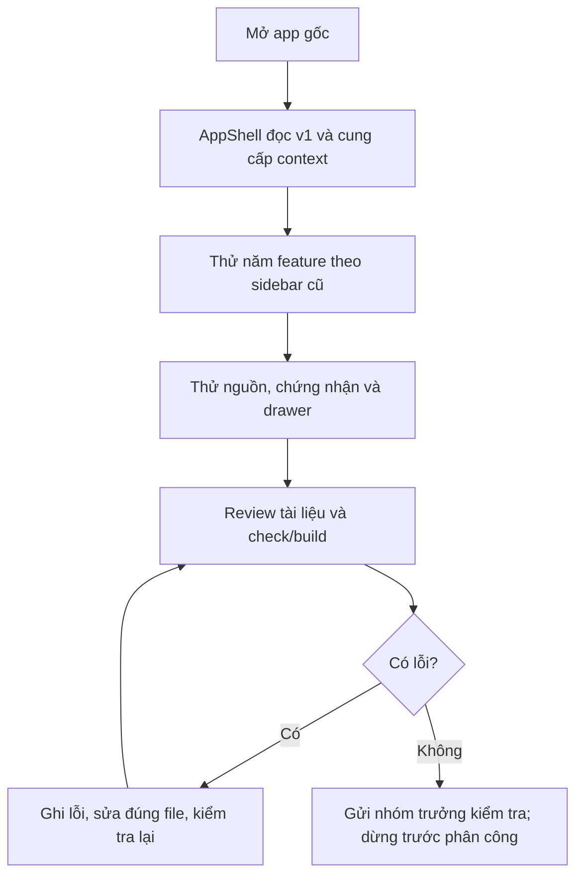

# Luồng bàn giao bộ khung

## FL-MW-SETUP-04-01 — Mở và review bản sau tách module

**Actor:** nhóm trưởng. **Điều kiện:** đã có clone/dependency; server local chạy; dữ liệu v1 cũ còn trên trình duyệt. **Đầu ra:** UI/module và bằng chứng có thể kiểm tra; chưa coi các chức năng v2 đã chạy.

| Bước | Hành động | Phản hồi / dữ liệu |
|---|---|---|
| S1 | Mở `/` | Entry nạp CSS cũ, HashRouter và AppShell |
| S2 | App khởi tạo | Đọc State v1 theo key cũ; context dùng chung cho các trang |
| S3 | Chuyển năm trang | Render module riêng; sidebar/routes/nguồn/plan/profile giữ hành vi cũ |
| S4 | Mở nguồn/chứng nhận và chặng | Đúng dữ liệu Java đang chọn; drawer mở/đóng, không thay plan Node đang giữ |
| S5 | Kiểm tra tài liệu/check/build | Đối chiếu cấu trúc, ranh giới file và trạng thái chưa tích hợp |
| S6 | Gửi phản hồi hoặc yêu cầu tiếp tục | Giữ bản review; chỉ lập phân công sau yêu cầu mới |

| Nhánh | Điều kiện | Xử lý / kết quả |
|---|---|---|
| E1 | Import sai sau tách file | TypeScript/dev server báo lỗi; sửa đường dẫn rồi kiểm tra lại, không xóa assertions |
| E2 | Storage v1 ném lỗi khi ghi | Hàm ghi trả false; App giữ trạng thái chưa lưu. Không reset dữ liệu |
| A1 | Chưa có kế hoạch | My plan giữ trạng thái trống của bản cũ |
| C1 | Nhóm trưởng chưa yêu cầu bước phân công | Dừng ở bộ khung và tài liệu review; không giao task hoặc cập nhật Notion |

Đây là luồng review bộ khung; không thay EF01–EF28 hoặc các luồng chức năng v2 cần mỗi người viết khi triển khai.
