# Luồng chi tiết — MW-TEAM-01

Người thực hiện: Nguyễn Thị Quỳnh Hân. Cập nhật sơ đồ: 10/10/2026.

Căn cứ [TASK.md §6](TASK.md#6-luồng-riêng-và-test-case-phải-viết), [quy định bàn giao](../../team/PHAN_CONG_MINI_PROJECT.md#6-mỗi-bạn-phải-nộp-đủ-code-nội-dung-và-bằng-chứng), [mẫu FLOW](../../templates/FLOW.md) và [feedback nhóm trưởng](FEEDBACK_20261009.md). **16 sơ đồ riêng:** 14 hành động trong 6 nhóm task + 2 hành động retry/discard của feedback. Giữ nguyên sáu mã nhóm được giao, thêm hậu tố A/B/C/D để tách hành động. Mã S/A/E/C trong từng hình trùng bảng của chính luồng đó.

**Baseline code:** main tích hợp `1e9bff4db59e75a6b90aa44f6b614a6ca5b73ee3` (PR #8); PR #5 đã được Hải merge tại `5800838` tối 09/10. Bộ này thay bảng luồng gộp cũ và hai sequence minh họa chưa commit. Không đổi nghiệp vụ hoặc code app. Dữ liệu v1 là nguồn migration chỉ đọc; ngành hồ sơ được AppShell chuyển qua saveProfile v2. Khoa khám phá/filter UI là local. Draft trong bộ nhớ, candidate chưa lưu và dữ liệu committed là ba trạng thái cần phân biệt.

**Ranh giới:** FL-06-C dừng tại giao diện My roadmap. Tạo/tạo lại plan, hoàn thành, chốt tuần, import/export backup do task tương ứng mô tả; TC-05 chỉ liên kết kiểm thử tích hợp. Không thêm 17 hình lặp cho 17 cấu hình. Không tự xác nhận nghiệm thu của reviewer.

## Danh mục và ánh xạ yêu cầu

| Nhóm task | Luồng / hình riêng | Acceptance | Test liên kết |
|---|---|---|---|
| FL-MW-TEAM-01-01 | [FL-MW-TEAM-01-01-A — Chọn ngành đang học](#fl-mw-team-01-01-a) | AC-01 / AC-05 | [TC-01 / TC-07](QA_AI_LOG.md) |
| FL-MW-TEAM-01-01 | [FL-MW-TEAM-01-01-B — Khám phá theo khoa khác](#fl-mw-team-01-01-b) | AC-01 | [TC-01 / TC-08](QA_AI_LOG.md) |
| FL-MW-TEAM-01-02 | [FL-MW-TEAM-01-02-A — Tìm và lọc hướng học](#fl-mw-team-01-02-a) | AC-01 / AC-03 | [TC-08 / TC-09](QA_AI_LOG.md) |
| FL-MW-TEAM-01-02 | [FL-MW-TEAM-01-02-B — Mở hướng học hoặc tổng quan](#fl-mw-team-01-02-b) | AC-01 / AC-02 / AC-05 | [TC-02 / TC-08 / TC-09](QA_AI_LOG.md) |
| FL-MW-TEAM-01-03 | [FL-MW-TEAM-01-03-A — Chọn hoặc đổi track](#fl-mw-team-01-03-a) | AC-02 / AC-04 / AC-05 | [TC-02 / TC-03 / TC-05 / TC-08](QA_AI_LOG.md) |
| FL-MW-TEAM-01-03 | [FL-MW-TEAM-01-03-B — Lưu lựa chọn roadmap draft](#fl-mw-team-01-03-b) | AC-05 | [TC-05 / TC-07 / TC-11b](QA_AI_LOG.md) |
| FL-MW-TEAM-01-04 | [FL-MW-TEAM-01-04-A — Mở thông tin một chặng](#fl-mw-team-01-04-a) | AC-02 / AC-03 | [TC-04 / TC-09](QA_AI_LOG.md) |
| FL-MW-TEAM-01-04 | [FL-MW-TEAM-01-04-B — Lọc nguồn học và xử lý rỗng](#fl-mw-team-01-04-b) | AC-03 / AC-05 | [TC-04 / TC-09](QA_AI_LOG.md) |
| FL-MW-TEAM-01-04 | [FL-MW-TEAM-01-04-C — Chọn nguồn và áp dụng chặng](#fl-mw-team-01-04-c) | AC-03 / AC-05 | [TC-04 / TC-05 / TC-07](QA_AI_LOG.md) |
| FL-MW-TEAM-01-04 | [FL-MW-TEAM-01-04-D — Hủy hoặc đóng drawer chặng](#fl-mw-team-01-04-d) | AC-03 / AC-05 | [TC-04 / TC-09 / TC-07](QA_AI_LOG.md) |
| FL-MW-TEAM-01-05 | [FL-MW-TEAM-01-05 — Mở roadmap hoặc nguồn ở tab mới](#fl-mw-team-01-05) | AC-03 | [TC-10 / TC-09](QA_AI_LOG.md) |
| FL-MW-TEAM-01-06 | [FL-MW-TEAM-01-06-A — Lưu mục tiêu chứng nhận](#fl-mw-team-01-06-a) | AC-03 / AC-05 | [TC-06 / TC-07](QA_AI_LOG.md) |
| FL-MW-TEAM-01-06 | [FL-MW-TEAM-01-06-B — Bỏ lưu mục tiêu chứng nhận](#fl-mw-team-01-06-b) | AC-03 / AC-05 | [TC-06 / TC-07](QA_AI_LOG.md) |
| FL-MW-TEAM-01-06 | [FL-MW-TEAM-01-06-C — Chuyển sang My roadmap](#fl-mw-team-01-06-c) | AC-02 / AC-05 | [TC-05 / TC-08](QA_AI_LOG.md) |
| Feedback 09/10 | [FL-MW-TEAM-01-07-A — Thử lưu lại candidate đang chờ](#fl-mw-team-01-07-a) | AC-05 · feedback 09/10 | [TC-07 / TC-11b / TC-11c](QA_AI_LOG.md) |
| Feedback 09/10 | [FL-MW-TEAM-01-07-B — Xác nhận bỏ candidate My Plan](#fl-mw-team-01-07-b) | AC-05 · feedback 09/10 | [TC-11 / TC-11b / TC-11c](QA_AI_LOG.md) |

## FL-MW-TEAM-01-01-A — Chọn ngành đang học

- Story / acceptance: US-MW-TEAM-01-01-A / AC-01 / AC-05. Story cụ thể: xem [TASK.md](TASK.md#story-theo-hành-động--bổ-sung-sơ-đồ-1010).
- Actor, trang, sự kiện: sinh viên trong app gốc; Chọn khoa/ngành. Explore / Path detail; FL-06-C bàn giao sang My roadmap.
- Điều kiện trước: Explore đã có workspace; catalog 6 khoa / 12 ngành. Không có save hoặc candidate chờ xử lý.
- Đầu vào / kiểm tra: Khoa/ngành từ select hoặc nút trong bảng ngành → hướng. Khoa hiện tại chọn ngành đầu tiên; chọn “Chưa chọn / Bỏ qua” dùng majorId=null.
- Sau thành công: Ngành được lưu trong workspace.profile.majorId; UI dùng ngành đó để ưu tiên quan hệ ngành–hướng.
- Giữ khi hủy/lỗi: Plans, activePlanId, completions, history, các draft và dữ liệu v1. Lỗi không đổi ngành đã commit.
- Code đối chiếu (baseline trên): `src/features/explore/Explore.tsx · profile-strip, major-matrix`; `src/app/AppShell.tsx · update`; `src/app/workspace-controller.ts · saveProfile, guard, commit`.
- Test / bằng chứng: [TC-01 / TC-07](QA_AI_LOG.md); [kiểm tra sơ đồ 10/10](DIAGRAMS_20261010.md). Liên kết test không đồng nghĩa mọi nhánh UI đã chạy lại hôm nay.

### Luồng chính và dữ liệu trước/sau

| Bước | Sinh viên | UI | Domain / persistence | Dữ liệu sau bước |
|---|---|---|---|---|
| S1 | Chọn khoa/ngành | Gửi patch.major qua update() | AppShell tạo profile với majorId mới; không sửa plan | Chưa ghi database |
| S2 | Chờ kết quả | Giữ lựa chọn đã lưu khi chưa thành công | saveProfile kiểm tra guard và validateWorkspace | Candidate hợp lệ hoặc bị từ chối |
| S3 | Chờ lưu | Topbar báo đang lưu | commit → persistence.saveWorkspace(candidate, revision) | Chờ kết quả lưu có kiểm tra revision |
| S4 | Xem ngành sau lưu | Áp dụng patch khi result.ok; effect đồng bộ từ profile | Kết quả persistence quyết định thành công | Thành công mới thay workspace đã commit |
| S5 | Khám phá hướng | Ưu tiên hướng theo ngành; hiện ghi chú Vi mạch nếu có | relationRank chỉ tính quan hệ catalog | Plan và lịch sử giữ nguyên |

### Nhánh thay thế, lỗi và hủy

| Mã | Từ bước | Điều kiện | Thông báo / xử lý | Trạng thái dữ liệu | Test |
|---|---|---|---|---|---|
| A1 | S1 | Bỏ qua ngành hoặc chọn từ bảng ngành–hướng | Ngành null; hoặc chọn major và reset bộ lọc theo nút bảng | Không tự tạo kế hoạch | TC-01 |
| E1 | S2 | Workspace chưa sẵn sàng / saving / pending / transfer hoặc validation lỗi | Trả issue; chưa ghi | Ngành committed giữ nguyên | TC-07 |
| E2 | S4 | Save lỗi / revision conflict | Hiện lỗi, giữ candidate shared để xử lý; không apply patch thành công | Disk không bị ghi đè; không báo đã lưu | TC-07 |
| C1 | S1 | Đóng select mà chưa chọn giá trị | Không có mutation; không có dialog xác nhận bỏ ngành | Giữ dữ liệu; đổi lại giá trị sau lưu là một lần lưu mới | TC-01 |

### Sơ đồ và mã bước

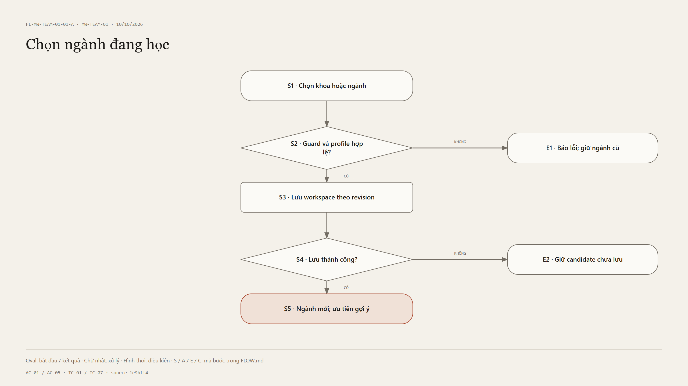

[Bản HTML](diagrams/fl-01-a.html) · [Vector SVG](diagrams/fl-01-a.svg). Mô tả theo main tích hợp 10/10: lưu ngành qua v2, không còn ghi localStorage v1. Hủy select trước chọn không cần sơ đồ xác nhận giả.

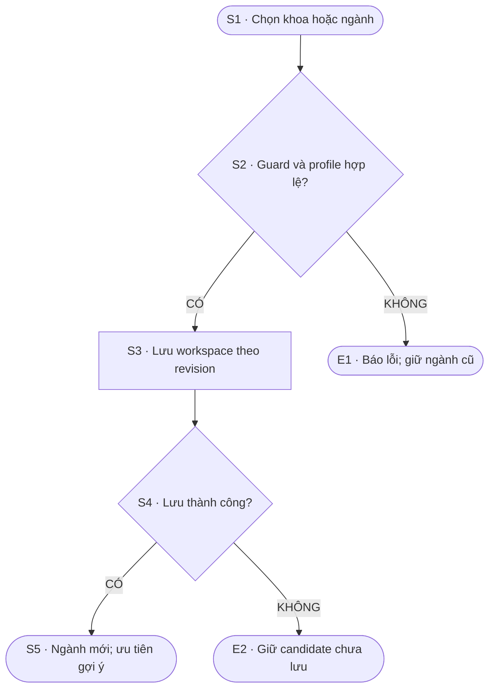
```mermaid
flowchart TD
  S1(["S1 · Chọn khoa hoặc ngành"])
  S2{"S2 · Guard và profile hợp lệ?"}
  S3["S3 · Lưu workspace theo revision"]
  S4{"S4 · Lưu thành công?"}
  S5(["S5 · Ngành mới; ưu tiên gợi ý"])
  E1(["E1 · Báo lỗi; giữ ngành cũ"])
  E2(["E2 · Giữ candidate chưa lưu"])
  S1 --> S2
  S2 -->|CÓ| S3
  S3 --> S4
  S4 -->|CÓ| S5
  S2 -->|KHÔNG| E1
  S4 -->|KHÔNG| E2
```

Mã bước trong PNG/SVG/HTML và Mermaid giống bảng. A/E/C không xuất hiện trên hình khi chỉ là diễn giải của một bước, lỗi ngoài app, hoặc hành động chưa thực hiện; bảng vẫn nêu điều kiện và trạng thái.

## FL-MW-TEAM-01-01-B — Khám phá theo khoa khác

- Story / acceptance: US-MW-TEAM-01-01-B / AC-01. Story cụ thể: xem [TASK.md](TASK.md#story-theo-hành-động--bổ-sung-sơ-đồ-1010).
- Actor, trang, sự kiện: sinh viên trong app gốc; Chọn “Khám phá theo khoa”. Explore / Path detail; FL-06-C bàn giao sang My roadmap.
- Điều kiện trước: Explore có catalog; ngành đang học và khoa khám phá là hai giá trị độc lập.
- Đầu vào / kiểm tra: browseFaculty là khoa được chọn hoặc all; giữ query/category/nearOnly hiện tại.
- Sau thành công: Đổi khoa khám phá và danh sách hướng đang hiển thị; ngành hồ sơ không đổi.
- Giữ khi hủy/lỗi: profile.majorId, draft, mọi plan/tiến độ và dữ liệu đã lưu.
- Code đối chiếu (baseline trên): `src/features/explore/Explore.tsx · browse-select, visiblePaths`; `src/app/AppShell.tsx · update`.
- Test / bằng chứng: [TC-01 / TC-08](QA_AI_LOG.md); [kiểm tra sơ đồ 10/10](DIAGRAMS_20261010.md). Liên kết test không đồng nghĩa mọi nhánh UI đã chạy lại hôm nay.

### Luồng chính và dữ liệu trước/sau

| Bước | Sinh viên | UI | Domain / persistence | Dữ liệu sau bước |
|---|---|---|---|---|
| S1 | Chọn “Khám phá theo khoa” | Gọi update({browseFaculty}) | AppShell cập nhật State tương thích trong bộ nhớ | Chỉ browseFaculty thay đổi |
| S2 | Xem danh sách | Tính browseMajors rồi lọc visiblePaths | Catalog xét majors/relatedMajors; giữ các bộ lọc khác | Không gọi persistence |
| S3 | Xem số hướng | Hiện số kết quả | Kiểm tra danh sách rỗng | Ngành hồ sơ không bị thay |
| S4 | Tiếp tục khám phá | Hiện card và mức gần/mở rộng | relationRank dùng ngành hồ sơ hiện tại | Chỉ kết quả trình bày thay đổi |

### Nhánh thay thế, lỗi và hủy

| Mã | Từ bước | Điều kiện | Thông báo / xử lý | Trạng thái dữ liệu | Test |
|---|---|---|---|---|---|
| A1 | S1 | Chọn tất cả khoa | Bỏ điều kiện giới hạn theo khoa | Giữ ngành và các bộ lọc còn lại | TC-01 |
| A2 | S3 | Không có hướng khớp tổng các bộ lọc | Hiện empty + Xóa bộ lọc hướng học; tiếp tục FL-02-A | Không sửa draft/plan | TC-08 |
| C1 | S1 | Đóng select trước chọn hoặc đổi lại khoa | Không mutation trước chọn; chọn lại chỉ đổi browseFaculty | Không có thao tác hoàn tác dữ liệu đã lưu | TC-01 |
| E1 | S2 | Không áp dụng lỗi storage cho hành động này | Không gọi persistence; không thêm thông báo “đã lưu khoa” | Khoa khám phá chỉ ở bộ nhớ phiên UI | TC-01 |

### Sơ đồ và mã bước

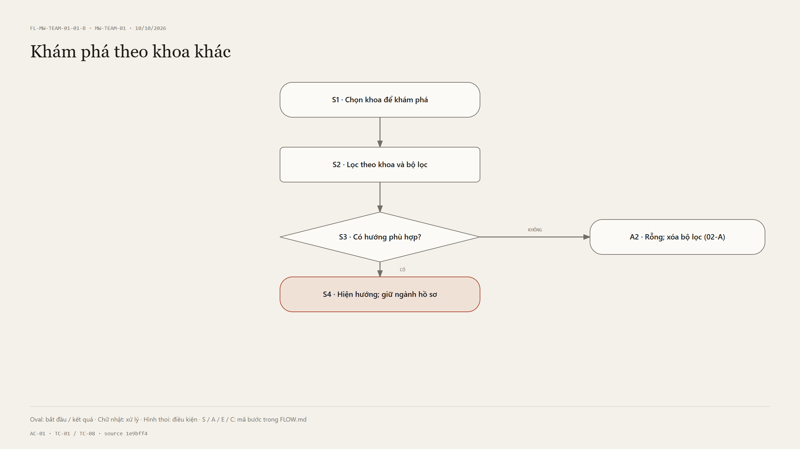

[Bản HTML](diagrams/fl-01-b.html) · [Vector SVG](diagrams/fl-01-b.svg). Không mô tả browseFaculty như thuộc tính hồ sơ được lưu qua IndexedDB.

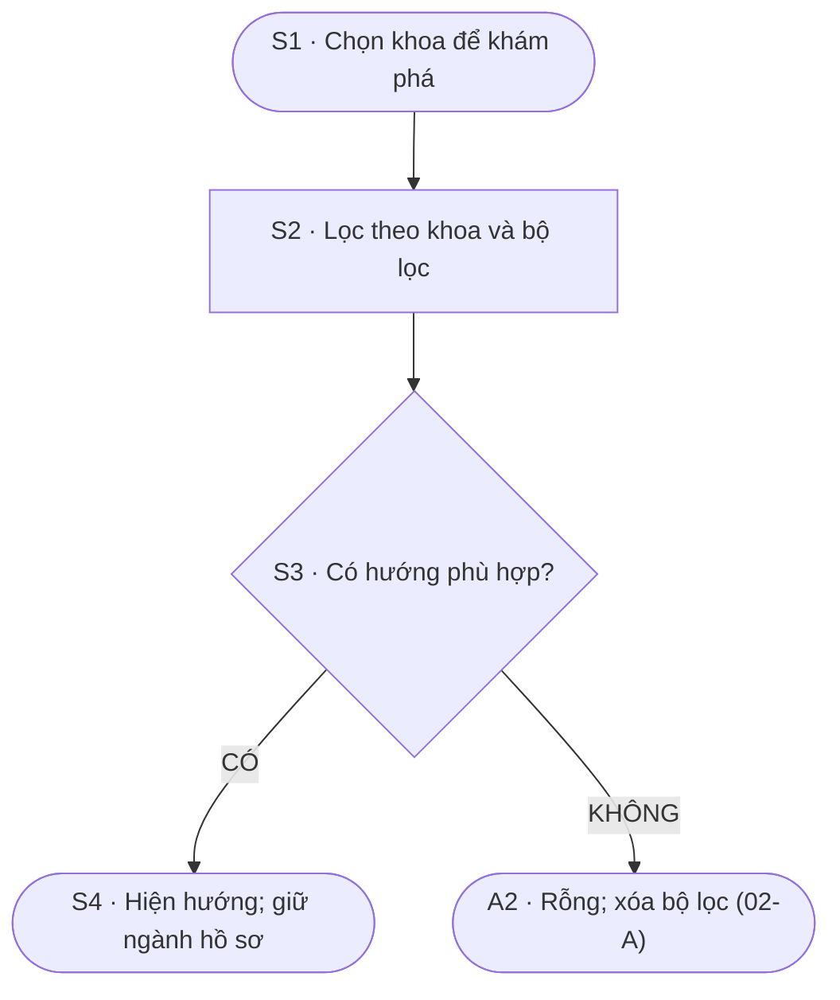
```mermaid
flowchart TD
  S1(["S1 · Chọn khoa để khám phá"])
  S2["S2 · Lọc theo khoa và bộ lọc"]
  S3{"S3 · Có hướng phù hợp?"}
  S4(["S4 · Hiện hướng; giữ ngành hồ sơ"])
  A2(["A2 · Rỗng; xóa bộ lọc (02-A)"])
  S1 --> S2
  S2 --> S3
  S3 -->|CÓ| S4
  S3 -->|KHÔNG| A2
```

Mã bước trong PNG/SVG/HTML và Mermaid giống bảng. A/E/C không xuất hiện trên hình khi chỉ là diễn giải của một bước, lỗi ngoài app, hoặc hành động chưa thực hiện; bảng vẫn nêu điều kiện và trạng thái.

## FL-MW-TEAM-01-02-A — Tìm và lọc hướng học

- Story / acceptance: US-MW-TEAM-01-02-A / AC-01 / AC-03. Story cụ thể: xem [TASK.md](TASK.md#story-theo-hành-động--bổ-sung-sơ-đồ-1010).
- Actor, trang, sự kiện: sinh viên trong app gốc; Nhập từ khóa / chọn nhóm / bật lọc gần ngành. Explore / Path detail; FL-06-C bàn giao sang My roadmap.
- Điều kiện trước: Explore mở; catalog hiện có 18 hướng. Có thể chưa chọn ngành.
- Đầu vào / kiểm tra: query, category, nearOnly và browseFaculty. nearOnly bị disabled khi chưa có ngành.
- Sau thành công: Danh sách và số kết quả khớp bộ lọc; không đổi nội dung draft/plan.
- Giữ khi hủy/lỗi: Ngành hồ sơ, lựa chọn nguồn, track đã lưu, kế hoạch và lịch sử.
- Code đối chiếu (baseline trên): `src/features/explore/Explore.tsx · visiblePaths, clearFilters, nearOnly effect`.
- Test / bằng chứng: [TC-08 / TC-09](QA_AI_LOG.md); [kiểm tra sơ đồ 10/10](DIAGRAMS_20261010.md). Liên kết test không đồng nghĩa mọi nhánh UI đã chạy lại hôm nay.

### Luồng chính và dữ liệu trước/sau

| Bước | Sinh viên | UI | Domain / persistence | Dữ liệu sau bước |
|---|---|---|---|---|
| S1 | Nhập từ khóa / chọn nhóm / bật lọc gần ngành | Cập nhật state lọc cục bộ | Không lưu; nếu thiếu ngành thì nearOnly=false | Chỉ các giá trị bộ lọc đổi |
| S2 | Xem kết quả | Tính visiblePaths | Lọc khoa → quan hệ ngành → nhóm → chuỗi không phân biệt hoa thường; sort theo relationRank | Danh sách tính lại |
| S3 | Đọc số kết quả | Hiện số card hoặc empty | Không có fallback sửa draft | Ngành và plan nguyên |
| S4 | Chọn hướng nếu muốn | Hiện card để tiếp tục FL-02-B | Không gọi persistence | Kết quả chỉ trên UI |

### Nhánh thay thế, lỗi và hủy

| Mã | Từ bước | Điều kiện | Thông báo / xử lý | Trạng thái dữ liệu | Test |
|---|---|---|---|---|---|
| A1 | S1 | Chưa có ngành | Không cho bật nearOnly; mọi hướng vẫn có thể tìm | Không tự chọn ngành | TC-01 / TC-08 |
| A2 | S3 | 0 kết quả | Hiện giải thích / ghi chú Vi mạch và nút Xóa bộ lọc hướng học | clearFilters: query trống, category=all, nearOnly=false, browseFaculty=all; tính lại S2 | TC-08 |
| C1 | S1 | Người dùng không tiếp tục lọc | Xóa/sửa bộ lọc hoặc rời trang; không có dialog hủy | State lọc local có thể mất khi unmount; profile/plan giữ | TC-09 |
| E1 | S2 | Chuỗi không khớp là empty, không phải lỗi lưu | Dùng A2; không tạo lỗi storage giả | Không ghi database | TC-08 |

### Sơ đồ và mã bước

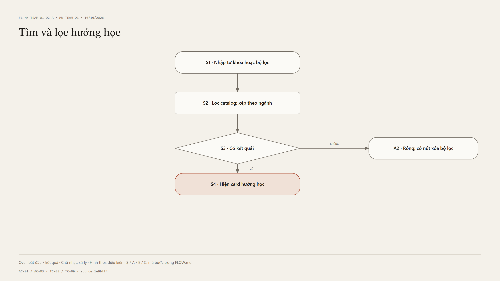

[Bản HTML](diagrams/fl-02-a.html) · [Vector SVG](diagrams/fl-02-a.svg). Xóa bộ lọc không xóa ngành hồ sơ và không reset dữ liệu học.

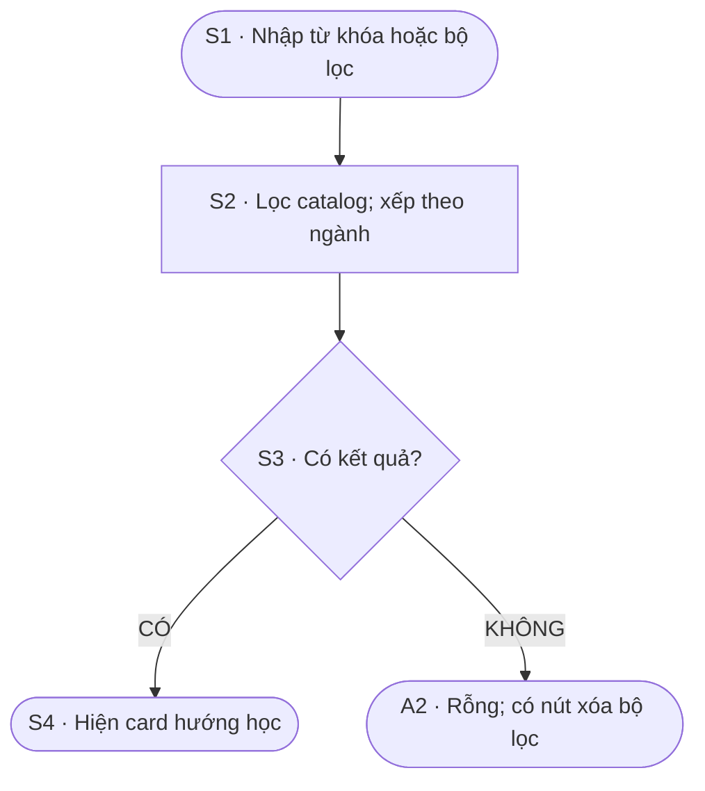
```mermaid
flowchart TD
  S1(["S1 · Nhập từ khóa hoặc bộ lọc"])
  S2["S2 · Lọc catalog; xếp theo ngành"]
  S3{"S3 · Có kết quả?"}
  S4(["S4 · Hiện card hướng học"])
  A2(["A2 · Rỗng; có nút xóa bộ lọc"])
  S1 --> S2
  S2 --> S3
  S3 -->|CÓ| S4
  S3 -->|KHÔNG| A2
```

Mã bước trong PNG/SVG/HTML và Mermaid giống bảng. A/E/C không xuất hiện trên hình khi chỉ là diễn giải của một bước, lỗi ngoài app, hoặc hành động chưa thực hiện; bảng vẫn nêu điều kiện và trạng thái.

## FL-MW-TEAM-01-02-B — Mở hướng học hoặc tổng quan

- Story / acceptance: US-MW-TEAM-01-02-B / AC-01 / AC-02 / AC-05. Story cụ thể: xem [TASK.md](TASK.md#story-theo-hành-động--bổ-sung-sơ-đồ-1010).
- Actor, trang, sự kiện: sinh viên trong app gốc; Bấm card hướng. Explore / Path detail; FL-06-C bàn giao sang My roadmap.
- Điều kiện trước: Có card Explore. Workspace đang tải có thể hiển thị loading khi vào Path detail.
- Đầu vào / kiểm tra: pathId của card; đăng ký contentPacks quyết định chi tiết hay dialog tổng quan.
- Sau thành công: Hướng có pack mở /path?id=... và xem nội dung resolve; hướng khác mở dialog tổng quan.
- Giữ khi hủy/lỗi: Ngành, plan đang học, plan cũ, completions và history; draft hướng khác.
- Code đối chiếu (baseline trên): `src/features/explore/Explore.tsx · isReady, preview`; `src/features/path-detail/PathDetail.tsx · pathId, trackId, resolveTrack, effect`.
- Test / bằng chứng: [TC-02 / TC-08 / TC-09](QA_AI_LOG.md); [kiểm tra sơ đồ 10/10](DIAGRAMS_20261010.md). Liên kết test không đồng nghĩa mọi nhánh UI đã chạy lại hôm nay.

### Luồng chính và dữ liệu trước/sau

| Bước | Sinh viên | UI | Domain / persistence | Dữ liệu sau bước |
|---|---|---|---|---|
| S1 | Bấm card hướng | Chọn Khám phá hướng này hoặc Xem tổng quan | Tra contentPacks theo pathId | Chưa tạo plan |
| S2 | Chờ trang / dialog | Kiểm tra hướng có pack | Nếu không có pack, mở preview local | Chỉ navigation hoặc preview |
| S3 | Đọc chi tiết | Path detail hiện loading; sau tải resolve track của hướng | trackId ưu tiên URL → selected cùng hướng → draft nhớ → mặc định; kiểm tra track.pathId | Resolve hoặc báo lỗi |
| S4 | Xem hướng hợp lệ | Hiện 3 tab và portfolio | Effect selectTrack; nếu chưa có draft, updateDraft goal portfolio trong bộ nhớ | Draft mới có thể dirty; chưa lưu và không kích hoạt plan |

### Nhánh thay thế, lỗi và hủy

| Mã | Từ bước | Điều kiện | Thông báo / xử lý | Trạng thái dữ liệu | Test |
|---|---|---|---|---|---|
| A1 | S2 | Hướng chưa có pack | Mở dialog tổng quan, nền tảng, ngành liên quan, link roadmap | Không nhân bản nội dung placeholder thành kế hoạch; không mutation v2 | TC-08 |
| A2 | S3 | Workspace loading | Hiện “Đang tải lựa chọn đã lưu…” | Chờ tải; chưa giả định có draft | TC-08 |
| E1 | S3 | Không tải được workspace / pack hoặc track không hợp lệ / sai hướng | Thử tải lại hoặc quay Explore; không fallback Backend cho ID sai | Giữ disk và plan cũ | TC-02 / TC-08 |
| C1 | S2 | Đóng tổng quan / Escape / Tiếp tục khám phá | setPreview(null) | Không đổi workspace; quay Explore từ Path detail không tự hoàn tác draft dirty | TC-09 |

### Sơ đồ và mã bước

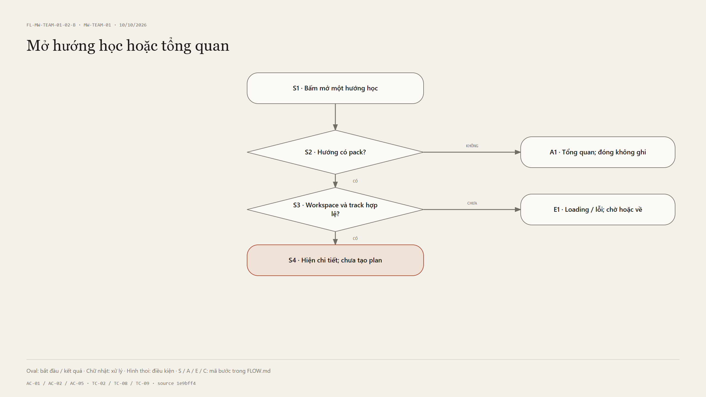

[Bản HTML](diagrams/fl-02-b.html) · [Vector SVG](diagrams/fl-02-b.svg). Loading là trạng thái chờ, không bị coi là validation failure; bảng A2/E1 tách rõ hai trường hợp. Sơ đồ không hứa navigation không đổi draft cục bộ.

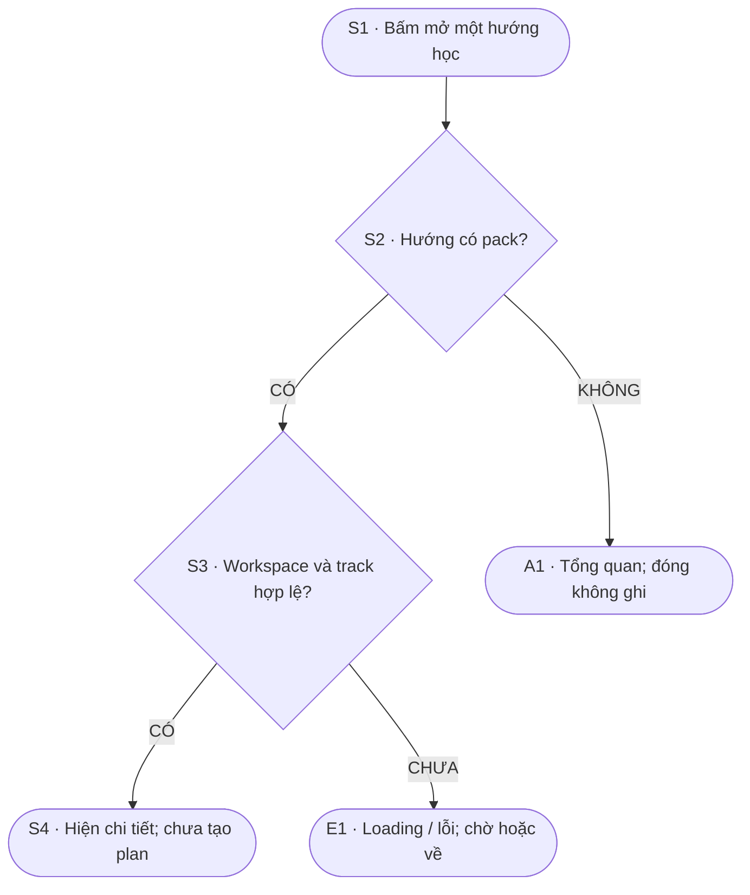
```mermaid
flowchart TD
  S1(["S1 · Bấm mở một hướng học"])
  S2{"S2 · Hướng có pack?"}
  S3{"S3 · Workspace và track hợp lệ?"}
  S4(["S4 · Hiện chi tiết; chưa tạo plan"])
  A1(["A1 · Tổng quan; đóng không ghi"])
  E1(["E1 · Loading / lỗi; chờ hoặc về"])
  S1 --> S2
  S2 -->|CÓ| S3
  S3 -->|CÓ| S4
  S2 -->|KHÔNG| A1
  S3 -->|CHƯA| E1
```

Mã bước trong PNG/SVG/HTML và Mermaid giống bảng. A/E/C không xuất hiện trên hình khi chỉ là diễn giải của một bước, lỗi ngoài app, hoặc hành động chưa thực hiện; bảng vẫn nêu điều kiện và trạng thái.

## FL-MW-TEAM-01-03-A — Chọn hoặc đổi track

- Story / acceptance: US-MW-TEAM-01-03-A / AC-02 / AC-04 / AC-05. Story cụ thể: xem [TASK.md](TASK.md#story-theo-hành-động--bổ-sung-sơ-đồ-1010).
- Actor, trang, sự kiện: sinh viên trong app gốc; Chọn hướng/nhánh. Explore / Path detail; FL-06-C bàn giao sang My roadmap.
- Điều kiện trước: Path detail đã có workspace và pack; select khóa khi loading, saving hoặc unsavedWorkspace.
- Đầu vào / kiểm tra: Chọn trackId, hoặc hướng mới lấy track đầu của pack. Full-stack chọn một trong chín track FE × BE có sẵn.
- Sau thành công: URL id/track, selectedTrackId và nội dung nhánh mới; draft nhớ hoặc draft mặc định. Không tự lưu/đổi activePlan.
- Giữ khi hủy/lỗi: Mọi plan, progress/history, draft nhánh khác và ID dùng chung.
- Code đối chiếu (baseline trên): `src/features/path-detail/PathDetail.tsx · choose, effect`; `src/app/workspace-controller.ts · selectTrack, getDraft, updateDraft`; `src/domain/content.ts · resolveTrackContent`; `src/content/paths/fullstack.ts · track builder`.
- Test / bằng chứng: [TC-02 / TC-03 / TC-05 / TC-08](QA_AI_LOG.md); [kiểm tra sơ đồ 10/10](DIAGRAMS_20261010.md). Liên kết test không đồng nghĩa mọi nhánh UI đã chạy lại hôm nay.

### Luồng chính và dữ liệu trước/sau

| Bước | Sinh viên | UI | Domain / persistence | Dữ liệu sau bước |
|---|---|---|---|---|
| S1 | Chọn hướng/nhánh | choose() kiểm tra busy | Chưa save | Dữ liệu committed chưa đổi |
| S2 | Chờ đổi nhánh | Nếu không busy, setParams id/track; đóng drawer và về tab Roadmap | Effect selectTrack còn kiểm tra guard, bao gồm transfer preview | URL/UI có thể đổi; không tạo plan |
| S3 | Đọc nội dung nhánh | resolveTrack và kiểm tra pathId | Resolver kiểm tra ID, tham chiếu, default nguồn, prerequisite thiếu/vòng/thứ tự | Trả nội dung đã resolve hoặc issue |
| S4 | Xem chặng và nguồn | Hiện nội dung; đọc draft nhớ hoặc mặc định | getDraft giữ draft đã có; nếu chưa có, effect updateDraft goal portfolio | Draft local có thể dirty; chưa ghi disk |
| S5 | Quyết định lưu sau | Dùng Lưu lựa chọn ở FL-03-B | Không tự kích hoạt/tạo lại plan khi khám phá | Plan/history giữ nguyên |

### Nhánh thay thế, lỗi và hủy

| Mã | Từ bước | Điều kiện | Thông báo / xử lý | Trạng thái dữ liệu | Test |
|---|---|---|---|---|---|
| A1 | S3 | Full-stack | Một FE + một BE; chặng nền dùng ID tham chiếu, chặng tích hợp đúng cặp | Không sao chép 9 bộ plan/nguồn; resolver là dùng chung | TC-03 |
| E1 | S2 | Busy / candidate chưa xử lý / controller transfer guard | UI select khóa khi busy; guard từ chối khi gọi action bị chặn | Không sửa committed; không cho dùng mutation mới né pending | TC-07 |
| E2 | S3 | Track thiếu/sai hướng/nội dung lỗi | Hiện issue; trở về Explore hoặc chọn track hợp lệ | Không âm thầm dùng Backend | TC-02 / TC-08 |
| C1 | S1 | Đóng select trước chọn | Không đổi track. Sau chọn, rời trang không tự hoàn tác draft | Lưu explicit ở FL-03-B; không giả định có nút Hủy track | TC-05 |

### Sơ đồ và mã bước

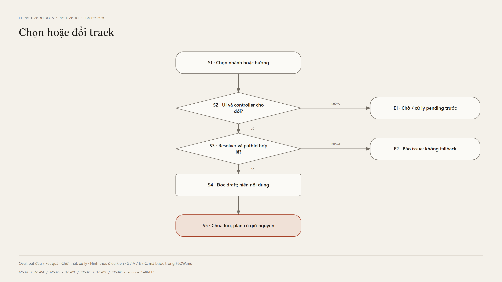

[Bản HTML](diagrams/fl-03-a.html) · [Vector SVG](diagrams/fl-03-a.svg). 17 track là cấu hình của luồng này; chín Full-stack kiểm thử từng cặp, không cần 17 sơ đồ giống nhau.

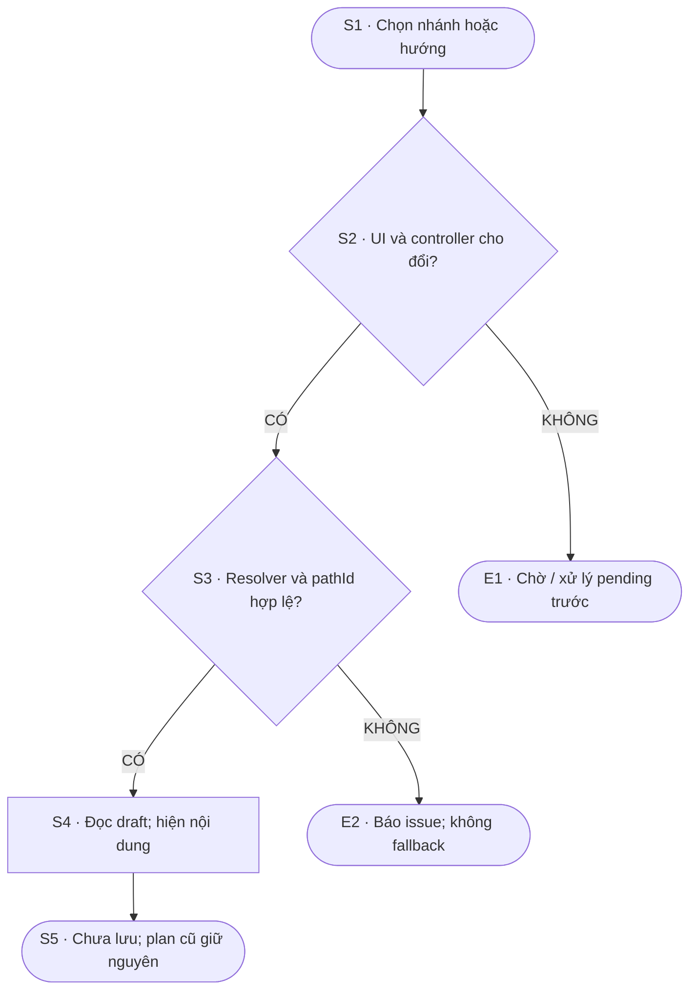
```mermaid
flowchart TD
  S1(["S1 · Chọn nhánh hoặc hướng"])
  S2{"S2 · UI và controller cho đổi?"}
  S3{"S3 · Resolver và pathId hợp lệ?"}
  S4["S4 · Đọc draft; hiện nội dung"]
  S5(["S5 · Chưa lưu; plan cũ giữ nguyên"])
  E1(["E1 · Chờ / xử lý pending trước"])
  E2(["E2 · Báo issue; không fallback"])
  S1 --> S2
  S2 -->|CÓ| S3
  S3 -->|CÓ| S4
  S4 --> S5
  S2 -->|KHÔNG| E1
  S3 -->|KHÔNG| E2
```

Mã bước trong PNG/SVG/HTML và Mermaid giống bảng. A/E/C không xuất hiện trên hình khi chỉ là diễn giải của một bước, lỗi ngoài app, hoặc hành động chưa thực hiện; bảng vẫn nêu điều kiện và trạng thái.

## FL-MW-TEAM-01-03-B — Lưu lựa chọn roadmap draft

- Story / acceptance: US-MW-TEAM-01-03-B / AC-05. Story cụ thể: xem [TASK.md](TASK.md#story-theo-hành-động--bổ-sung-sơ-đồ-1010).
- Actor, trang, sự kiện: sinh viên trong app gốc; Bấm Lưu lựa chọn. Explore / Path detail; FL-06-C bàn giao sang My roadmap.
- Điều kiện trước: Path detail có workspace và draft trong bộ nhớ. Lưu lựa chọn không phải tạo plan.
- Đầu vào / kiểm tra: Snapshot workspace hiện tại và revision; nếu đã có unsavedWorkspace, nút chuyển sang Thử lưu lại.
- Sau thành công: Persistence commit draft; dirty=false và toast “Đã lưu lựa chọn trên thiết bị”. Reload đọc lại nguồn/nhánh đã lưu.
- Giữ khi hủy/lỗi: Plan hiện tại, lịch sử, draft khác và disk cũ nếu save lỗi.
- Code đối chiếu (baseline trên): `src/features/path-detail/PathDetail.tsx · save`; `src/app/workspace-controller.ts · saveDraft, commit, retrySave`; `src/persistence/roadmap-store.ts · saveWorkspace`.
- Test / bằng chứng: [TC-05 / TC-07 / TC-11b](QA_AI_LOG.md); [kiểm tra sơ đồ 10/10](DIAGRAMS_20261010.md). Liên kết test không đồng nghĩa mọi nhánh UI đã chạy lại hôm nay.

### Luồng chính và dữ liệu trước/sau

| Bước | Sinh viên | UI | Domain / persistence | Dữ liệu sau bước |
|---|---|---|---|---|
| S1 | Bấm Lưu lựa chọn | Khóa nút khi saving | Nếu có pending → FL-07-A; còn lại gọi saveDraft | Không dựng candidate mới khi đã pending |
| S2 | Chờ lưu | Topbar đang lưu | guard kiểm tra workspace/saving/pending/transfer | Bị chặn thì chưa gọi persistence |
| S3 | Chờ commit | Không báo success sớm | commit clone workspace → saveWorkspace với revision hiện tại | Adapter validation/revision trước khi ghi |
| S4 | Nhận kết quả | Toast chỉ khi saved.ok | Success nhận workspace trả về; failure giữ unsavedWorkspace | Disk commit hoặc còn nguyên |
| S5 | Reload để xem | Nguồn/nhánh đã lưu xuất hiện từ draft | dirty=false, error=null, pending=null sau success | Plan/history vẫn nguyên |

### Nhánh thay thế, lỗi và hủy

| Mã | Từ bước | Điều kiện | Thông báo / xử lý | Trạng thái dữ liệu | Test |
|---|---|---|---|---|---|
| A1 | S1 | Đã có candidate do lần save trước lỗi | Gọi retrySave, chuyển FL-07-A | Lưu lại đúng candidate, không tạo bản khác | TC-11b |
| E1 | S2 | Workspace chưa sẵn sàng / saving / transfer preview | Trả guard issue; chưa ghi | Giữ draft và disk | TC-07 |
| E2 | S4 | Validation / storage / revision conflict | Hiện lỗi; dirty=true, giữ candidate; không toast success | Không ghi đè revision mới của tab khác | TC-07 / TC-11c |
| C1 | S3 | Save đã bắt đầu | Không có nút hủy transaction; chờ kết quả | Không mô tả đóng trang như rollback; muốn bỏ pending cần xác nhận sau failure | TC-11b |

### Sơ đồ và mã bước

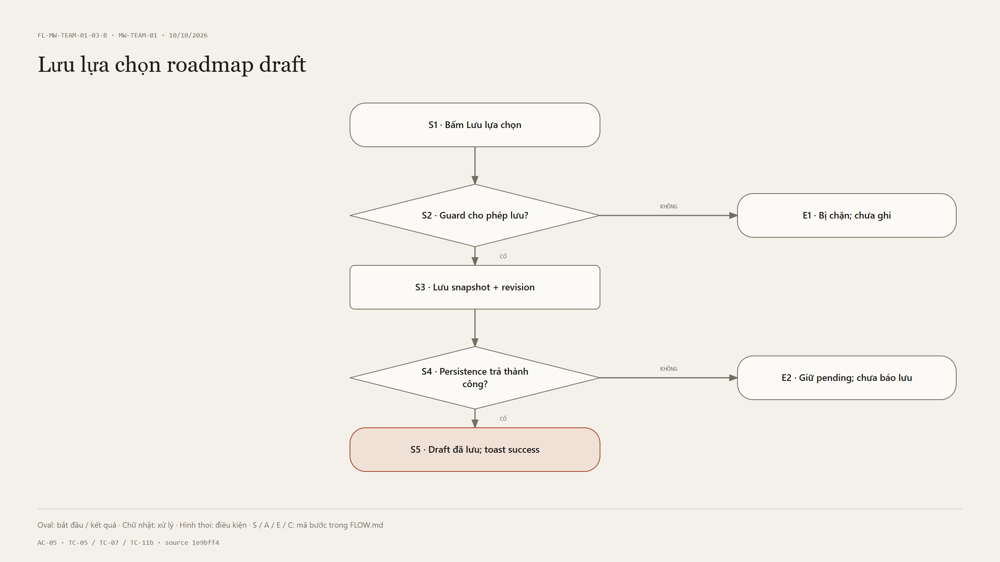

[Bản HTML](diagrams/fl-03-b.html) · [Vector SVG](diagrams/fl-03-b.svg). Nhánh A1 liên kết FL-07-A; mọi nhánh lỗi/hủy đều giữ plan cũ.

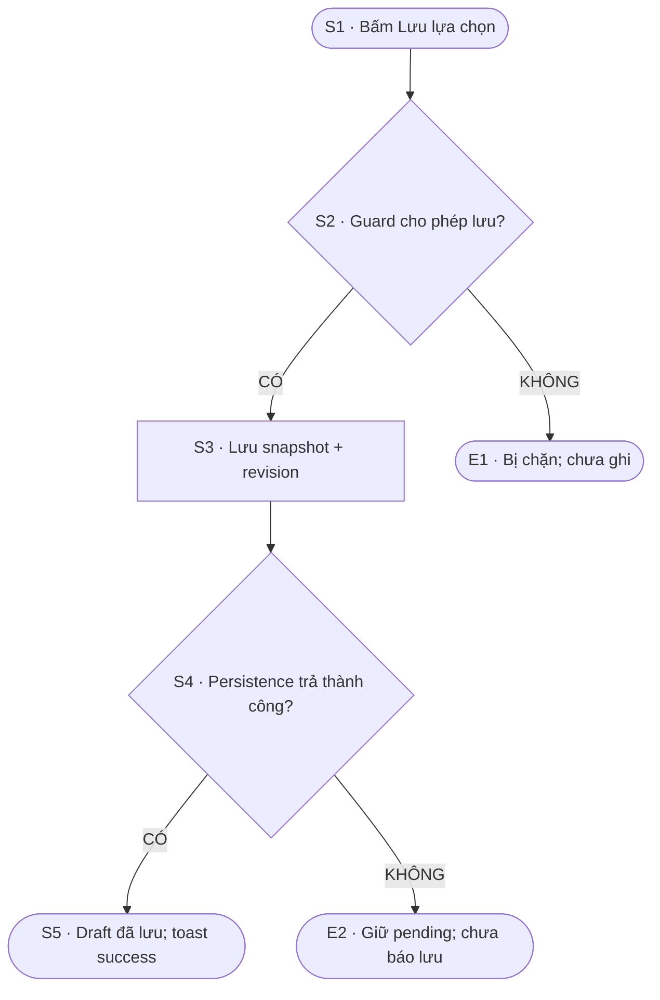
```mermaid
flowchart TD
  S1(["S1 · Bấm Lưu lựa chọn"])
  S2{"S2 · Guard cho phép lưu?"}
  S3["S3 · Lưu snapshot + revision"]
  S4{"S4 · Persistence trả thành công?"}
  S5(["S5 · Draft đã lưu; toast success"])
  E1(["E1 · Bị chặn; chưa ghi"])
  E2(["E2 · Giữ pending; chưa báo lưu"])
  S1 --> S2
  S2 -->|CÓ| S3
  S3 --> S4
  S4 -->|CÓ| S5
  S2 -->|KHÔNG| E1
  S4 -->|KHÔNG| E2
```

Mã bước trong PNG/SVG/HTML và Mermaid giống bảng. A/E/C không xuất hiện trên hình khi chỉ là diễn giải của một bước, lỗi ngoài app, hoặc hành động chưa thực hiện; bảng vẫn nêu điều kiện và trạng thái.

## FL-MW-TEAM-01-04-A — Mở thông tin một chặng

- Story / acceptance: US-MW-TEAM-01-04-A / AC-02 / AC-03. Story cụ thể: xem [TASK.md](TASK.md#story-theo-hành-động--bổ-sung-sơ-đồ-1010).
- Actor, trang, sự kiện: sinh viên trong app gốc; Bấm chặng / Enter. Explore / Path detail; FL-06-C bàn giao sang My roadmap.
- Điều kiện trước: Path detail đã resolve track và danh sách stage.
- Đầu vào / kiểm tra: stageId lấy từ nút chặng thuộc resolved.stages.
- Sau thành công: StageDrawer hiển thị outcome, nguồn, bài thực hành; tạo source/selected/known local từ draft.
- Giữ khi hủy/lỗi: Draft shared, plan và dữ liệu đã lưu; mở drawer chưa gọi updateDraft/save.
- Code đối chiếu (baseline trên): `src/features/path-detail/PathDetail.tsx · inspect`; `src/features/path-detail/StageDrawer.tsx · local state`; `src/components/ui.tsx · Dialog`.
- Test / bằng chứng: [TC-04 / TC-09](QA_AI_LOG.md); [kiểm tra sơ đồ 10/10](DIAGRAMS_20261010.md). Liên kết test không đồng nghĩa mọi nhánh UI đã chạy lại hôm nay.

### Luồng chính và dữ liệu trước/sau

| Bước | Sinh viên | UI | Domain / persistence | Dữ liệu sau bước |
|---|---|---|---|---|
| S1 | Bấm chặng / Enter | setInspect(stage.id) | Không ghi | Chỉ inspect local |
| S2 | Chờ drawer | Kiểm tra inspect có trong resolved.stages | Không dựng drawer cho stage thiếu | Shared draft nguyên |
| S3 | Xem drawer | Mount theo key trackId/stageId; Dialog.showModal | getDraft và resolveTrack; source từ draft hoặc default | source/selected/known chỉ local |
| S4 | Đọc outcome, nguồn, bài | Hiện phút và acceptance; có thể tiếp tục chọn ở FL-04-C | Không gọi persistence | Không tạo dấu đã học |

### Nhánh thay thế, lỗi và hủy

| Mã | Từ bước | Điều kiện | Thông báo / xử lý | Trạng thái dữ liệu | Test |
|---|---|---|---|---|---|
| A1 | S3 | Có nguồn từng chọn | Đọc resourceByStage; nếu không có dùng defaultResourceId | Không tự lưu default mới | TC-04 |
| E1 | S2 | Stage không có trong resolved track | Không render drawer; lỗi track được xử lý ở FL-03-A | Không tự chọn stage khác | TC-02 |
| C1 | S3 | Đóng / Escape / click ngoài | onClose nếu không saving; trở về Path detail | Local drawer mất; trước Apply shared không đổi (FL-04-D) | TC-09 |

### Sơ đồ và mã bước

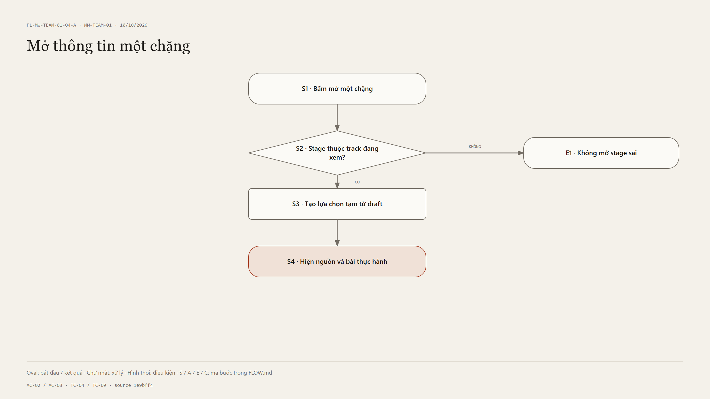

[Bản HTML](diagrams/fl-04-a.html) · [Vector SVG](diagrams/fl-04-a.svg). Bài thực hành có phút và acceptance; mở hoặc đọc drawer không chứng minh đã học.

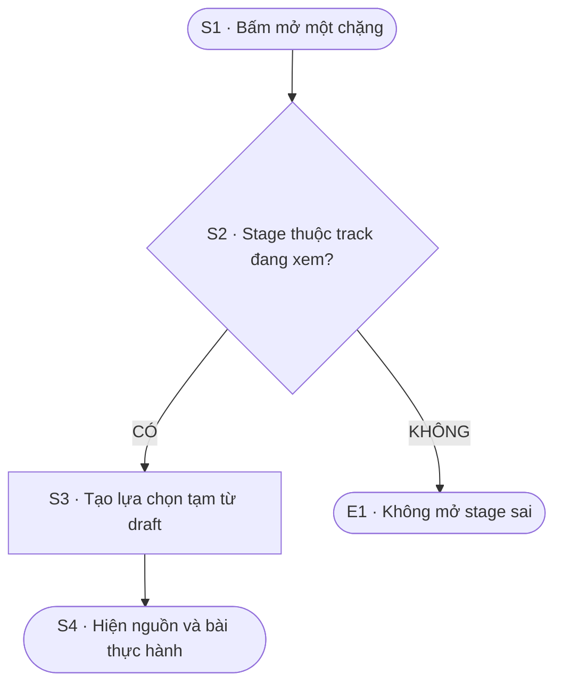
```mermaid
flowchart TD
  S1(["S1 · Bấm mở một chặng"])
  S2{"S2 · Stage thuộc track đang xem?"}
  S3["S3 · Tạo lựa chọn tạm từ draft"]
  S4(["S4 · Hiện nguồn và bài thực hành"])
  E1(["E1 · Không mở stage sai"])
  S1 --> S2
  S2 -->|CÓ| S3
  S3 --> S4
  S2 -->|KHÔNG| E1
```

Mã bước trong PNG/SVG/HTML và Mermaid giống bảng. A/E/C không xuất hiện trên hình khi chỉ là diễn giải của một bước, lỗi ngoài app, hoặc hành động chưa thực hiện; bảng vẫn nêu điều kiện và trạng thái.

## FL-MW-TEAM-01-04-B — Lọc nguồn học và xử lý rỗng

- Story / acceptance: US-MW-TEAM-01-04-B / AC-03 / AC-05. Story cụ thể: xem [TASK.md](TASK.md#story-theo-hành-động--bổ-sung-sơ-đồ-1010).
- Actor, trang, sự kiện: sinh viên trong app gốc; Chọn ngôn ngữ / miễn phí; nhập query ở tab nguồn. Explore / Path detail; FL-06-C bàn giao sang My roadmap.
- Điều kiện trước: Đang ở tab Nguồn học hoặc StageDrawer của track đã resolve.
- Đầu vào / kiểm tra: Ngôn ngữ tài liệu all/vi/en; freeOnly. Tab nguồn còn có query. Drawer chỉ lọc nguồn của stage.
- Sau thành công: Danh sách nguồn phù hợp bộ lọc hoặc trạng thái rỗng với cách nới lọc.
- Giữ khi hủy/lỗi: source local đang chọn, resourceByStage shared, ngôn ngữ lập trình của track và plan.
- Code đối chiếu (baseline trên): `src/features/path-detail/PathDetail.tsx · resources filter, empty`; `src/features/path-detail/StageDrawer.tsx · visible, Nới bộ lọc`.
- Test / bằng chứng: [TC-04 / TC-09](QA_AI_LOG.md); [kiểm tra sơ đồ 10/10](DIAGRAMS_20261010.md). Liên kết test không đồng nghĩa mọi nhánh UI đã chạy lại hôm nay.

### Luồng chính và dữ liệu trước/sau

| Bước | Sinh viên | UI | Domain / persistence | Dữ liệu sau bước |
|---|---|---|---|---|
| S1 | Chọn ngôn ngữ / miễn phí; nhập query ở tab nguồn | Cập nhật filter local | Không updateDraft | Chỉ filter đổi |
| S2 | Đọc danh sách | Tab dùng toàn track; drawer dùng stage.resourceIds | Lọc metadata language/cost; query theo title/provider/accessNote ở tab | Không đổi Java/Python theo vi/en |
| S3 | Xem số nguồn | Kiểm tra visible/resources.length | Không tự thay source nếu bị ẩn | Source và draft giữ |
| S4 | Đọc hoặc chọn nguồn còn hiển thị | Hiện provider/cost/accessNote/checkedAt | Chọn nguồn nếu trong drawer → FL-04-C | Không ghi chỉ vì lọc |

### Nhánh thay thế, lỗi và hủy

| Mã | Từ bước | Điều kiện | Thông báo / xử lý | Trạng thái dữ liệu | Test |
|---|---|---|---|---|---|
| A1 | S3 | Không còn nguồn | Hiện empty và Nới bộ lọc (drawer) / Xóa bộ lọc (tab) | Reset filter local rồi tính lại S2; vẫn giữ source đang chọn | TC-04 |
| A2 | S2 | Nguồn mixed/paid/unknown | Chỉ nguồn cost=free qua freeOnly | Không suy ra miễn phí từ URL trả 200 | TC-10 |
| C1 | S1 | Rời tab / đóng drawer | Không có xác nhận cho filter; đóng drawer theo FL-04-D | Draft/plan không đổi do lọc | TC-09 |
| E1 | S3 | Rỗng không phải lỗi persistence | Xử lý A1; không báo lưu thành công/thất bại | Không có write | TC-04 |

### Sơ đồ và mã bước

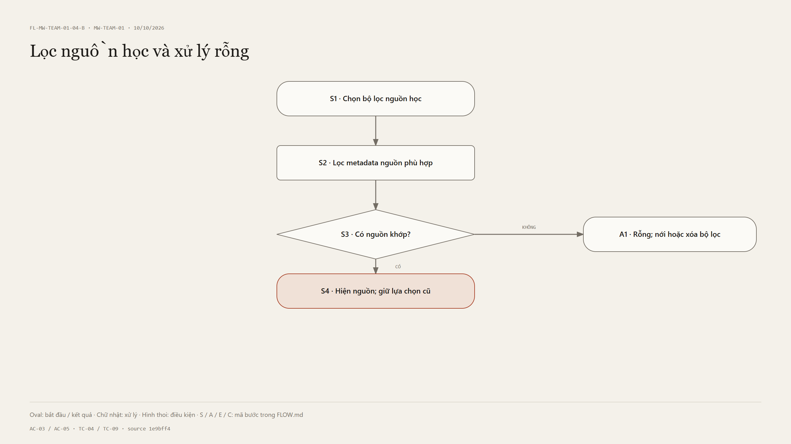

[Bản HTML](diagrams/fl-04-b.html) · [Vector SVG](diagrams/fl-04-b.svg). Tiếng Việt/Anh là ngôn ngữ tài liệu; bộ lọc không đổi ngôn ngữ lập trình.

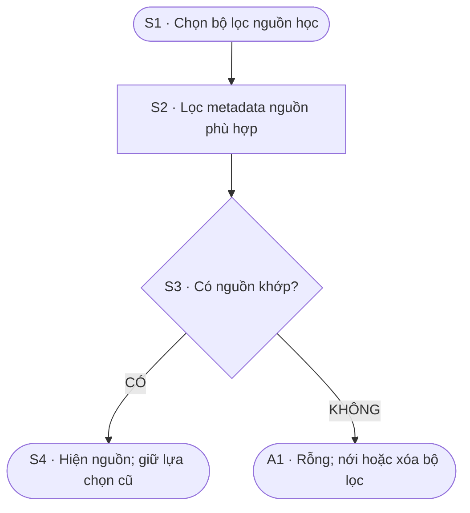
```mermaid
flowchart TD
  S1(["S1 · Chọn bộ lọc nguồn học"])
  S2["S2 · Lọc metadata nguồn phù hợp"]
  S3{"S3 · Có nguồn khớp?"}
  S4(["S4 · Hiện nguồn; giữ lựa chọn cũ"])
  A1(["A1 · Rỗng; nới hoặc xóa bộ lọc"])
  S1 --> S2
  S2 --> S3
  S3 -->|CÓ| S4
  S3 -->|KHÔNG| A1
```

Mã bước trong PNG/SVG/HTML và Mermaid giống bảng. A/E/C không xuất hiện trên hình khi chỉ là diễn giải của một bước, lỗi ngoài app, hoặc hành động chưa thực hiện; bảng vẫn nêu điều kiện và trạng thái.

## FL-MW-TEAM-01-04-C — Chọn nguồn và áp dụng chặng

- Story / acceptance: US-MW-TEAM-01-04-C / AC-03 / AC-05. Story cụ thể: xem [TASK.md](TASK.md#story-theo-hành-động--bổ-sung-sơ-đồ-1010).
- Actor, trang, sự kiện: sinh viên trong app gốc; Chọn nguồn và checkbox. Explore / Path detail; FL-06-C bàn giao sang My roadmap.
- Điều kiện trước: StageDrawer có draft và stage hợp lệ. Không loading/saving/pending/transfer để mutation mới được phép.
- Đầu vào / kiểm tra: source thuộc stage.resourceIds; checkbox thêm chặng và đã biết. Các lựa chọn này ban đầu chỉ local.
- Sau thành công: Sau Apply và persistence success, draft của track có nguồn/chặng/known mới; toast và đóng drawer.
- Giữ khi hủy/lỗi: Plan và lịch sử; draft khác. Nếu failure, disk cũ giữ nguyên, không toast success, giữ candidate.
- Code đối chiếu (baseline trên): `src/features/path-detail/StageDrawer.tsx · apply`; `src/app/workspace-controller.ts · updateDraft, saveDraft, commit`; `src/persistence/roadmap-store.ts · validation/revision`.
- Test / bằng chứng: [TC-04 / TC-05 / TC-07](QA_AI_LOG.md); [kiểm tra sơ đồ 10/10](DIAGRAMS_20261010.md). Liên kết test không đồng nghĩa mọi nhánh UI đã chạy lại hôm nay.

### Luồng chính và dữ liệu trước/sau

| Bước | Sinh viên | UI | Domain / persistence | Dữ liệu sau bước |
|---|---|---|---|---|
| S1 | Chọn nguồn và checkbox | source/selected/known local; locked khi saving hoặc pending | Không mutation shared trước Apply | Disk và shared draft nguyên |
| S2 | Bấm Áp dụng và lưu | Nếu pending có sẵn, nút là Thử lưu lại → FL-07-A | Nếu chưa pending: updateDraft giữ thứ tự curriculum; guard có thể từ chối | Shared draft đổi trong bộ nhớ, dirty=true nếu action hợp lệ |
| S3 | Chờ kết quả | saving khóa chọn nguồn, checkbox và Hủy | saveDraft → commit → persistence validation/revision | Bắt đầu ghi có kiểm tra |
| S4 | Nhận kết quả lưu | Success hoặc báo issue trong drawer | Success nhận workspace committed; failure giữ unsavedWorkspace | Đã commit hoặc disk vẫn cũ |
| S5 | Quay Path detail | Success mới toast và onClose | Không thay activePlan/current snapshot từ draft | Draft đã lưu, plan/history nguyên |

### Nhánh thay thế, lỗi và hủy

| Mã | Từ bước | Điều kiện | Thông báo / xử lý | Trạng thái dữ liệu | Test |
|---|---|---|---|---|---|
| A1 | S1 | Nguồn bị lọc ẩn | Giữ source cũ, có thể nới lọc | Không auto chọn nguồn thay | TC-04 |
| A2 | S2 | Đã có pending do save lỗi | Thử lưu lại đúng candidate, không updateDraft lần nữa | Theo FL-07-A | TC-07 |
| E1 | S2 | Guard / ID nhánh lỗi | setMessage issues; không đi tới saveDraft | Giữ dữ liệu và local lựa chọn | TC-02 / TC-07 |
| E2 | S4 | Save lỗi / conflict / validation | Drawer còn mở, giữ pending; input khóa, nút retry có thể dùng sau saving | Disk committed giữ; shared draft có thể vẫn dirty | TC-07 |
| C1 | S1 | Hủy trước Apply | FL-04-D; không updateDraft/save | Bỏ local và giữ shared | TC-04 |
| C2 | S3 | Đang saving | Không cho Hủy/Đóng/Escape hủy transaction | Chờ kết quả; đóng sau failure không bỏ pending | TC-11b |

### Sơ đồ và mã bước

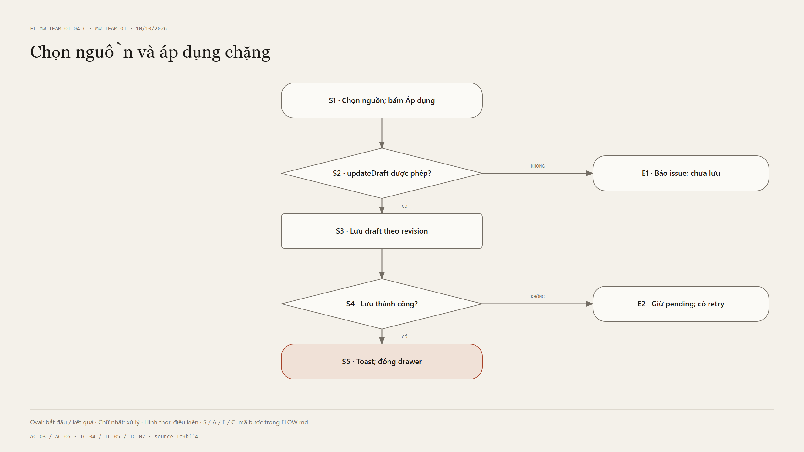

[Bản HTML](diagrams/fl-04-c.html) · [Vector SVG](diagrams/fl-04-c.svg). Diagram cho lần Apply mới; nếu có pending thì đi FL-07-A. Checkbox chặng/đã biết là lựa chọn tạm trong cùng hành động Apply, không phải hai mutation riêng.

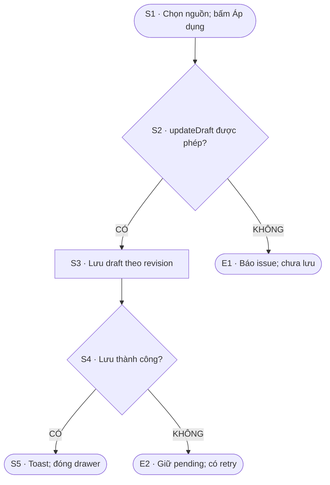
```mermaid
flowchart TD
  S1(["S1 · Chọn nguồn; bấm Áp dụng"])
  S2{"S2 · updateDraft được phép?"}
  S3["S3 · Lưu draft theo revision"]
  S4{"S4 · Lưu thành công?"}
  S5(["S5 · Toast; đóng drawer"])
  E1(["E1 · Báo issue; chưa lưu"])
  E2(["E2 · Giữ pending; có retry"])
  S1 --> S2
  S2 -->|CÓ| S3
  S3 --> S4
  S4 -->|CÓ| S5
  S2 -->|KHÔNG| E1
  S4 -->|KHÔNG| E2
```

Mã bước trong PNG/SVG/HTML và Mermaid giống bảng. A/E/C không xuất hiện trên hình khi chỉ là diễn giải của một bước, lỗi ngoài app, hoặc hành động chưa thực hiện; bảng vẫn nêu điều kiện và trạng thái.

## FL-MW-TEAM-01-04-D — Hủy hoặc đóng drawer chặng

- Story / acceptance: US-MW-TEAM-01-04-D / AC-03 / AC-05. Story cụ thể: xem [TASK.md](TASK.md#story-theo-hành-động--bổ-sung-sơ-đồ-1010).
- Actor, trang, sự kiện: sinh viên trong app gốc; Bấm Hủy/Đóng hoặc Escape. Explore / Path detail; FL-06-C bàn giao sang My roadmap.
- Điều kiện trước: StageDrawer đang mở; phân biệt trước Apply và sau Apply thất bại.
- Đầu vào / kiểm tra: Hủy, nút Đóng, Escape hoặc click ngoài dialog; status saving kiểm soát onClose.
- Sau thành công: Drawer đóng khi không saving; bỏ state local của drawer. Trước Apply thì shared/disk giữ nguyên.
- Giữ khi hủy/lỗi: Mọi plan/history và disk. Sau Apply thất bại, dirty/shared candidate vẫn phải được giữ để xử lý.
- Code đối chiếu (baseline trên): `src/features/path-detail/StageDrawer.tsx · Dialog.onClose, Hủy`; `src/components/ui.tsx · Dialog.onCancel, onClick`; `src/features/path-detail/PathDetail.tsx · setInspect(null)`.
- Test / bằng chứng: [TC-04 / TC-09 / TC-07](QA_AI_LOG.md); [kiểm tra sơ đồ 10/10](DIAGRAMS_20261010.md). Liên kết test không đồng nghĩa mọi nhánh UI đã chạy lại hôm nay.

### Luồng chính và dữ liệu trước/sau

| Bước | Sinh viên | UI | Domain / persistence | Dữ liệu sau bước |
|---|---|---|---|---|
| S1 | Bấm Hủy/Đóng hoặc Escape | Yêu cầu onClose | Chưa có thao tác persistence do đóng | Tạm giữ drawer |
| S2 | Chờ đóng | Kiểm tra status saving | Nếu saving thì chặn đóng; không abort save | Ghi đang chạy không bị hủy |
| S3 | Quay trang chi tiết | onClose → inspect=null; unmount drawer | source/selected/known local bị bỏ | Nếu chưa Apply: shared draft nguyên |
| S4 | Tiếp tục thao tác | Kiểm tra có shared pending sau lần Apply lỗi | Đóng drawer không gọi discardPendingSave | Nếu pending: vẫn giữ candidate; cần retry/xác nhận tải committed |
| S5 | Mở lại khi cần | Hiện draft/shared hiện có | Không thông báo đã bỏ candidate chung chỉ vì đóng drawer | Không reset disk/plan |

### Nhánh thay thế, lỗi và hủy

| Mã | Từ bước | Điều kiện | Thông báo / xử lý | Trạng thái dữ liệu | Test |
|---|---|---|---|---|---|
| E1 | S2 | Đang saving | Hủy disabled; onClose từ chối; chờ kết quả | Không rollback transaction | TC-11b |
| A1 | S4 | Đã Apply nhưng save lỗi | Shared pending còn; xử lý ở FL-07-A hoặc My roadmap xác nhận tải committed | Không hứa source cũ khi mở lại: shared draft có thể dirty | TC-07 |
| C1 | S3 | Chưa Apply | Bỏ local; mở lại đọc draft trước chỉnh | resourceByStage shared nguyên; không write | TC-04 / TC-09 |

### Sơ đồ và mã bước

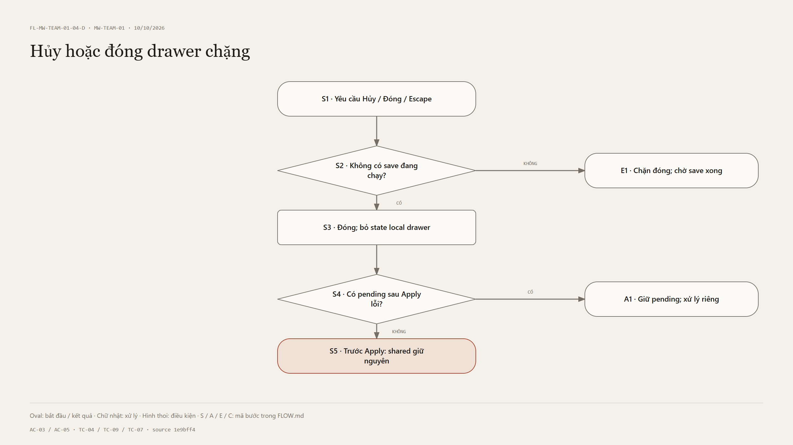

[Bản HTML](diagrams/fl-04-d.html) · [Vector SVG](diagrams/fl-04-d.svg). Hủy lựa chọn tạm khác với xác nhận bỏ shared candidate. Callback hủy của feedback My Plan nằm riêng ở FL-07-B.

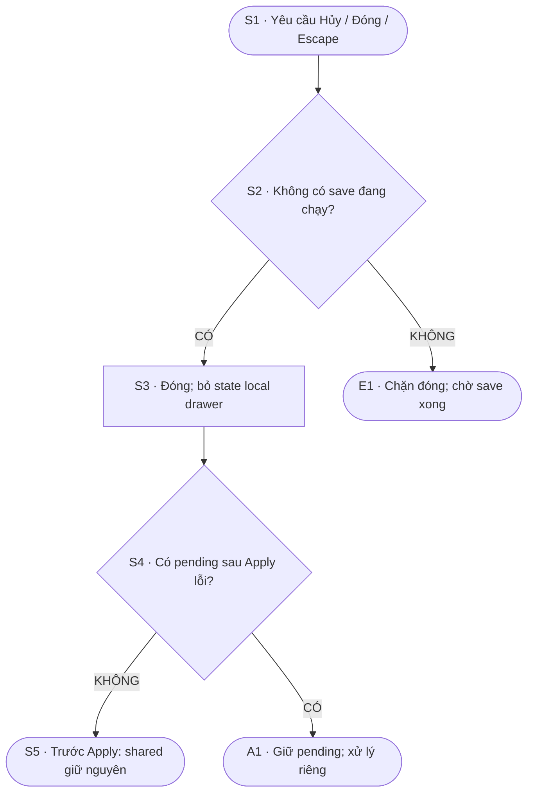
```mermaid
flowchart TD
  S1(["S1 · Yêu cầu Hủy / Đóng / Escape"])
  S2{"S2 · Không có save đang chạy?"}
  S3["S3 · Đóng; bỏ state local drawer"]
  S4{"S4 · Có pending sau Apply lỗi?"}
  S5(["S5 · Trước Apply: shared giữ nguyên"])
  E1(["E1 · Chặn đóng; chờ save xong"])
  A1(["A1 · Giữ pending; xử lý riêng"])
  S1 --> S2
  S2 -->|CÓ| S3
  S3 --> S4
  S4 -->|KHÔNG| S5
  S2 -->|KHÔNG| E1
  S4 -->|CÓ| A1
```

Mã bước trong PNG/SVG/HTML và Mermaid giống bảng. A/E/C không xuất hiện trên hình khi chỉ là diễn giải của một bước, lỗi ngoài app, hoặc hành động chưa thực hiện; bảng vẫn nêu điều kiện và trạng thái.

## FL-MW-TEAM-01-05 — Mở roadmap hoặc nguồn ở tab mới

- Story / acceptance: US-MW-TEAM-01-05 / AC-03. Story cụ thể: xem [TASK.md](TASK.md#story-theo-hành-động--bổ-sung-sơ-đồ-1010).
- Actor, trang, sự kiện: sinh viên trong app gốc; Bấm link roadmap/nguồn/chứng nhận. Explore / Path detail; FL-06-C bàn giao sang My roadmap.
- Điều kiện trước: Link có trong catalog/track/resource/credential đã resolve; metadata URL/provider được biên soạn.
- Đầu vào / kiểm tra: href lấy từ dữ liệu nội dung đã kiểm tra. External là anchor target=_blank, rel=noreferrer.
- Sau thành công: Trình duyệt yêu cầu mở trang nguồn ở tab mới; app không đánh dấu đã học hoặc được cấp chứng nhận.
- Giữ khi hủy/lỗi: Draft, ngành, nguồn đang chọn, plan, completions và history.
- Code đối chiếu (baseline trên): `src/components/ui.tsx · External, RoadmapLinks`; `src/features/explore/Explore.tsx · roadmap links`; `src/features/path-detail/PathDetail.tsx · External`; `src/features/path-detail/StageDrawer.tsx · External`.
- Test / bằng chứng: [TC-10 / TC-09](QA_AI_LOG.md); [kiểm tra sơ đồ 10/10](DIAGRAMS_20261010.md). Liên kết test không đồng nghĩa mọi nhánh UI đã chạy lại hôm nay.

### Luồng chính và dữ liệu trước/sau

| Bước | Sinh viên | UI | Domain / persistence | Dữ liệu sau bước |
|---|---|---|---|---|
| S1 | Bấm link roadmap/nguồn/chứng nhận | External anchor nhận href | Không gọi workspace action | App không mutation |
| S2 | Chờ trang ngoài | Browser xử lý target=_blank, rel=noreferrer | Không có fetch/kiểm tra kết quả HTTP trong callback app | Yêu cầu mở tab, không bảo đảm trang nguồn tải |
| S3 | Đọc nguồn nếu tải được | Xem điều kiện ở nhà cung cấp | Việc học/thi/cấp chứng nhận thuộc nguồn ngoài | Không auto completion |
| S4 | Đóng tab ngoài / trở lại app | Tiếp tục vị trí cũ | Không gọi persistence | Dữ liệu học nguyên |

### Nhánh thay thế, lỗi và hủy

| Mã | Từ bước | Điều kiện | Thông báo / xử lý | Trạng thái dữ liệu | Test |
|---|---|---|---|---|---|
| E1 | S2 | Mạng/URL/trang nhà cung cấp lỗi hoặc trình duyệt chặn tab | Lỗi do browser/trang ngoài; app không hiện success học hoặc tự thay URL | Workspace nguyên; báo nguồn lỗi để review | TC-10 |
| A1 | S1 | Link chứng nhận | Đọc phí, điều kiện, prerequisite, checkedAt; không coi HTTP 200 là đủ điều kiện | Không đăng ký/mua khóa tự động | TC-10 |
| C1 | S1 | Không bấm hoặc đóng tab ngoài | Không có mutation để hoàn tác | Không đánh dấu đã học | TC-09 |

### Sơ đồ và mã bước

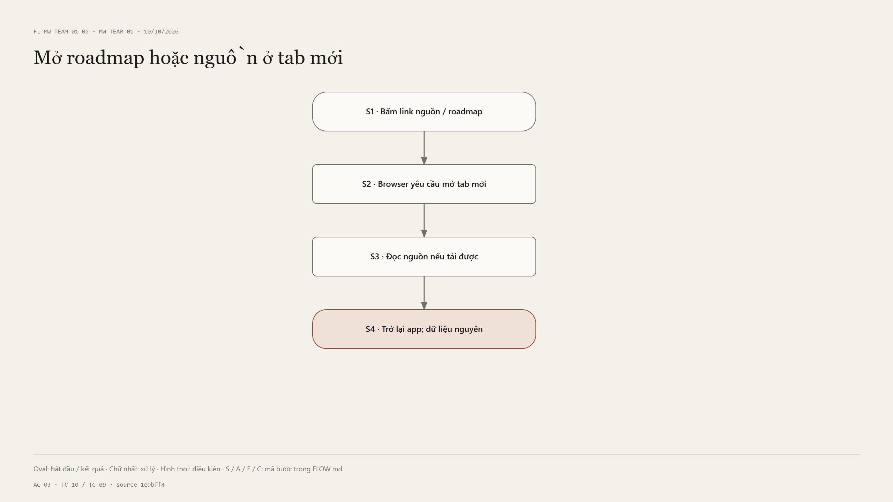

[Bản HTML](diagrams/fl-05.html) · [Vector SVG](diagrams/fl-05.svg). Lỗi tải nguồn thuộc trình duyệt/nhà cung cấp, không có nhánh HTTP success/failure do app thực thi. Metadata/URL được kiểm tra ở TC-10, không tại click.

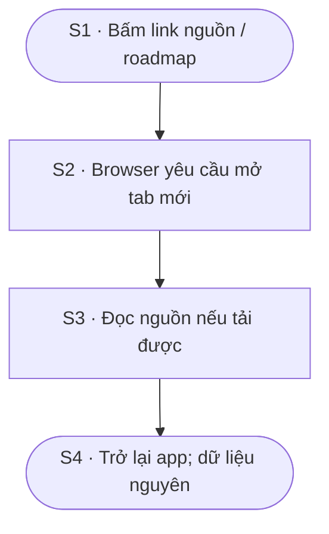
```mermaid
flowchart TD
  S1(["S1 · Bấm link nguồn / roadmap"])
  S2["S2 · Browser yêu cầu mở tab mới"]
  S3["S3 · Đọc nguồn nếu tải được"]
  S4(["S4 · Trở lại app; dữ liệu nguyên"])
  S1 --> S2
  S2 --> S3
  S3 --> S4
```

Mã bước trong PNG/SVG/HTML và Mermaid giống bảng. A/E/C không xuất hiện trên hình khi chỉ là diễn giải của một bước, lỗi ngoài app, hoặc hành động chưa thực hiện; bảng vẫn nêu điều kiện và trạng thái.

## FL-MW-TEAM-01-06-A — Lưu mục tiêu chứng nhận

- Story / acceptance: US-MW-TEAM-01-06-A / AC-03 / AC-05. Story cụ thể: xem [TASK.md](TASK.md#story-theo-hành-động--bổ-sung-sơ-đồ-1010).
- Actor, trang, sự kiện: sinh viên trong app gốc; Bấm Lưu chứng nhận. Explore / Path detail; FL-06-C bàn giao sang My roadmap.
- Điều kiện trước: Tab Chứng nhận của track hợp lệ; credential chưa trong savedCredentialIds; UI không busy.
- Đầu vào / kiểm tra: credential.id có trong registry. Không phải bằng chứng đã đạt chứng nhận.
- Sau thành công: ID được thêm vào savedCredentialIds sau commit; toast đã lưu mục tiêu; Profile đọc cùng workspace.
- Giữ khi hủy/lỗi: Plan/progress/history và mọi mục tiêu khác; failure giữ danh sách committed cũ.
- Code đối chiếu (baseline trên): `src/features/path-detail/PathDetail.tsx · credentials bookmark`; `src/app/workspace-controller.ts · toggleCredential`; `src/app/WorkspaceProfile.tsx · saved credentials`.
- Test / bằng chứng: [TC-06 / TC-07](QA_AI_LOG.md); [kiểm tra sơ đồ 10/10](DIAGRAMS_20261010.md). Liên kết test không đồng nghĩa mọi nhánh UI đã chạy lại hôm nay.

### Luồng chính và dữ liệu trước/sau

| Bước | Sinh viên | UI | Domain / persistence | Dữ liệu sau bước |
|---|---|---|---|---|
| S1 | Bấm Lưu chứng nhận | Nút disabled khi loading/saving/pending | Gọi toggleCredential(id) | Chưa đổi biểu tượng trước commit |
| S2 | Chờ xử lý | Giữ trạng thái saved đã commit | guard và kiểm tra ID trong packs.credentials | ID hợp lệ hoặc issue |
| S3 | Chờ lưu | saving | commit candidate thêm ID, revision hiện tại | Không đổi plan hay bằng chứng học |
| S4 | Nhận kết quả | Toast chỉ khi result.ok | Success thay workspace; failure giữ candidate shared | Disk thành công hoặc còn nguyên |
| S5 | Xem Profile / reload | Hiện mục tiêu đã lưu | savedCredentialIds là nguồn dùng chung | Không coi mục tiêu là chứng chỉ đã đạt |

### Nhánh thay thế, lỗi và hủy

| Mã | Từ bước | Điều kiện | Thông báo / xử lý | Trạng thái dữ liệu | Test |
|---|---|---|---|---|---|
| A1 | S1 | Track không có credential riêng | Hiện portfolio là đầu ra chính, không thêm mục tiêu giả | Không có mutation | TC-03 |
| E1 | S2 | Guard hoặc CREDENTIAL_NOT_FOUND | Trả issue; không gọi commit | Giữ danh sách | TC-06 / TC-07 |
| E2 | S4 | Lỗi lưu / conflict | Không toast thành công; giữ pending để retry | ID chưa có trên committed | TC-07 |
| C1 | S1 | Không bấm nút | Không mutation; sau bấm không có dialog xác nhận/hủy riêng | Bỏ lưu sau success là FL-06-B, không rollback | TC-06 |

### Sơ đồ và mã bước

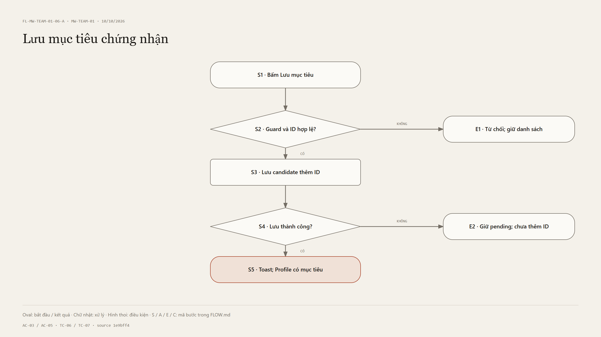

[Bản HTML](diagrams/fl-06-a.html) · [Vector SVG](diagrams/fl-06-a.svg). Chứng nhận là mục tiêu bổ trợ; lưu bookmark không chứng minh học/thi thành công.

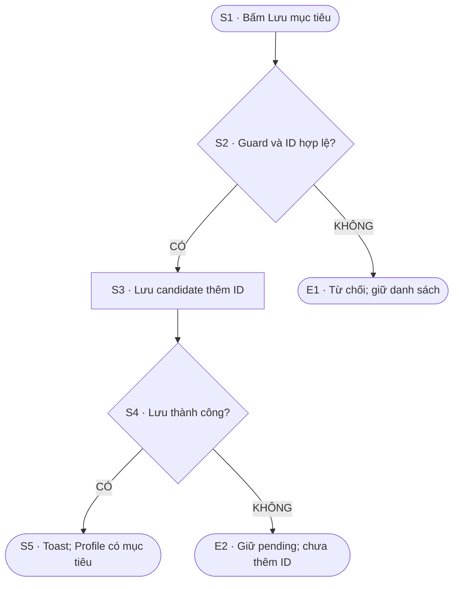
```mermaid
flowchart TD
  S1(["S1 · Bấm Lưu mục tiêu"])
  S2{"S2 · Guard và ID hợp lệ?"}
  S3["S3 · Lưu candidate thêm ID"]
  S4{"S4 · Lưu thành công?"}
  S5(["S5 · Toast; Profile có mục tiêu"])
  E1(["E1 · Từ chối; giữ danh sách"])
  E2(["E2 · Giữ pending; chưa thêm ID"])
  S1 --> S2
  S2 -->|CÓ| S3
  S3 --> S4
  S4 -->|CÓ| S5
  S2 -->|KHÔNG| E1
  S4 -->|KHÔNG| E2
```

Mã bước trong PNG/SVG/HTML và Mermaid giống bảng. A/E/C không xuất hiện trên hình khi chỉ là diễn giải của một bước, lỗi ngoài app, hoặc hành động chưa thực hiện; bảng vẫn nêu điều kiện và trạng thái.

## FL-MW-TEAM-01-06-B — Bỏ lưu mục tiêu chứng nhận

- Story / acceptance: US-MW-TEAM-01-06-B / AC-03 / AC-05. Story cụ thể: xem [TASK.md](TASK.md#story-theo-hành-động--bổ-sung-sơ-đồ-1010).
- Actor, trang, sự kiện: sinh viên trong app gốc; Bấm Bỏ lưu chứng nhận. Explore / Path detail; FL-06-C bàn giao sang My roadmap.
- Điều kiện trước: Credential đã có trong savedCredentialIds; tab Chứng nhận không busy.
- Đầu vào / kiểm tra: credential.id được render từ track và đang saved; cùng callback toggleCredential.
- Sau thành công: Sau commit thành công, chỉ ID đó bị bỏ khỏi savedCredentialIds; toast đã bỏ mục tiêu.
- Giữ khi hủy/lỗi: Các mục tiêu còn lại, plan/completion/history; failure giữ ID ở committed.
- Code đối chiếu (baseline trên): `src/features/path-detail/PathDetail.tsx · saved, toggleCredential`; `src/app/workspace-controller.ts · toggleCredential`.
- Test / bằng chứng: [TC-06 / TC-07](QA_AI_LOG.md); [kiểm tra sơ đồ 10/10](DIAGRAMS_20261010.md). Liên kết test không đồng nghĩa mọi nhánh UI đã chạy lại hôm nay.

### Luồng chính và dữ liệu trước/sau

| Bước | Sinh viên | UI | Domain / persistence | Dữ liệu sau bước |
|---|---|---|---|---|
| S1 | Bấm Bỏ lưu chứng nhận | Dùng trạng thái saved ở render; không dialog xác nhận | toggleCredential(id) | Committed chưa đổi |
| S2 | Chờ xử lý | Nút khóa nếu busy | guard, ID registry; saved.filter loại ID này | Candidate chỉ đổi danh sách mục tiêu |
| S3 | Chờ lưu | saving | commit → persistence.saveWorkspace theo revision | Chưa báo đã bỏ |
| S4 | Nhận kết quả | Toast sau result.ok | Success thay workspace; error giữ pending | Commit hoặc giữ disk cũ |
| S5 | Xem Profile / reload | Mục tiêu đó không còn trong danh sách | Không xóa plan/history liên quan | Các mục tiêu khác giữ |

### Nhánh thay thế, lỗi và hủy

| Mã | Từ bước | Điều kiện | Thông báo / xử lý | Trạng thái dữ liệu | Test |
|---|---|---|---|---|---|
| A1 | S1 | Muốn lưu lại sau success | Bấm Lưu; thực hiện FL-06-A | Một mutation mới, không undo transaction | TC-06 |
| E1 | S2 | ID thiếu / workspace bị chặn | Issue; chưa ghi | ID committed giữ | TC-06 / TC-07 |
| E2 | S4 | Save lỗi / conflict | Không báo đã bỏ; giữ pending | ID vẫn có trên committed | TC-07 |
| C1 | S1 | Không thực hiện bấm | Không mutation; không dựng xác nhận hủy không có trong UI | Không xóa học liệu hoặc dữ liệu lịch sử | TC-06 |

### Sơ đồ và mã bước

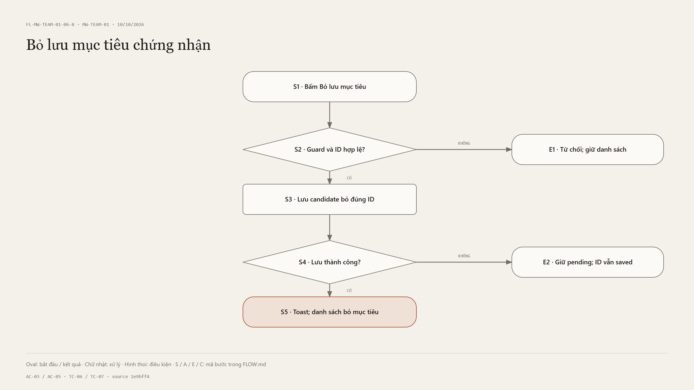

[Bản HTML](diagrams/fl-06-b.html) · [Vector SVG](diagrams/fl-06-b.svg). Bỏ lưu bookmark không phải xóa chứng nhận đã đạt và không xóa dữ liệu học.

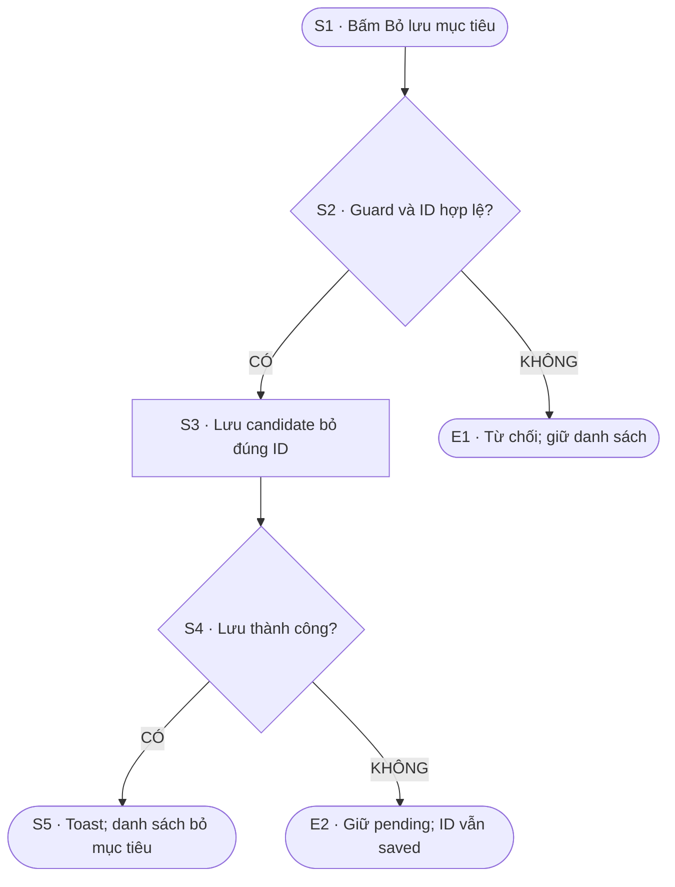
```mermaid
flowchart TD
  S1(["S1 · Bấm Bỏ lưu mục tiêu"])
  S2{"S2 · Guard và ID hợp lệ?"}
  S3["S3 · Lưu candidate bỏ đúng ID"]
  S4{"S4 · Lưu thành công?"}
  S5(["S5 · Toast; danh sách bỏ mục tiêu"])
  E1(["E1 · Từ chối; giữ danh sách"])
  E2(["E2 · Giữ pending; ID vẫn saved"])
  S1 --> S2
  S2 -->|CÓ| S3
  S3 --> S4
  S4 -->|CÓ| S5
  S2 -->|KHÔNG| E1
  S4 -->|KHÔNG| E2
```

Mã bước trong PNG/SVG/HTML và Mermaid giống bảng. A/E/C không xuất hiện trên hình khi chỉ là diễn giải của một bước, lỗi ngoài app, hoặc hành động chưa thực hiện; bảng vẫn nêu điều kiện và trạng thái.

## FL-MW-TEAM-01-06-C — Chuyển sang My roadmap

- Story / acceptance: US-MW-TEAM-01-06-C / AC-02 / AC-05. Story cụ thể: xem [TASK.md](TASK.md#story-theo-hành-động--bổ-sung-sơ-đồ-1010).
- Actor, trang, sự kiện: sinh viên trong app gốc; Bấm Tùy chỉnh roadmap. Explore / Path detail; FL-06-C bàn giao sang My roadmap.
- Điều kiện trước: Path detail có track hợp lệ; người dùng bấm Tùy chỉnh roadmap.
- Đầu vào / kiểm tra: Link /roadmap?track=<trackId> được encode từ track đang xem; không gọi createPlan.
- Sau thành công: My roadmap dùng selectedTrackId và draft để hiển thị chặng, nguồn, giờ/ngày/mục tiêu.
- Giữ khi hủy/lỗi: Plan hiện tại, completions/history; các draft khác. Navigation không tự tạo/lưu plan.
- Code đối chiếu (baseline trên): `src/features/path-detail/PathDetail.tsx · Tùy chỉnh roadmap`; `src/features/my-roadmap/MyRoadmap.tsx · queryTrack effect, resolve/getDraft`; `src/app/workspace-controller.ts · selectTrack`.
- Test / bằng chứng: [TC-05 / TC-08](QA_AI_LOG.md); [kiểm tra sơ đồ 10/10](DIAGRAMS_20261010.md). Liên kết test không đồng nghĩa mọi nhánh UI đã chạy lại hôm nay.

### Luồng chính và dữ liệu trước/sau

| Bước | Sinh viên | UI | Domain / persistence | Dữ liệu sau bước |
|---|---|---|---|---|
| S1 | Bấm Tùy chỉnh roadmap | React Router mở URL có track | Không persistence | Chỉ route đổi |
| S2 | Chờ My roadmap | Loading nếu chưa có workspace/selectedTrackId | Effect gọi selectTrack(queryTrack) khi workspace sẵn sàng | Guard/resolve có thể từ chối |
| S3 | Xem nhánh được chọn | resolveTrack(selectedTrackId) và getDraft | Không âm thầm tạo plan; query sai trả issues | Dùng draft chung hoặc mặc định |
| S4 | Đọc editor roadmap | Hiện chặng, nguồn, quỹ giờ; có lỗi nếu action bị chặn | Tạo plan/tạo lại là thao tác khác do module MW-TEAM-02 sở hữu | Plan/history giữ nguyên |

### Nhánh thay thế, lỗi và hủy

| Mã | Từ bước | Điều kiện | Thông báo / xử lý | Trạng thái dữ liệu | Test |
|---|---|---|---|---|---|
| A1 | S2 | Loading | Đợi tải workspace; không báo chuyển/lưu thành công trước tải | Không write | TC-08 |
| E1 | S2 | Guard: saving / pending / transfer, hoặc queryTrack sai | selectTrack trả issue; có thể vẫn hiện draft của selectedTrackId cũ | Không khẳng định nhánh URL đã được chọn khi guard từ chối | TC-07 / TC-08 |
| E2 | S3 | SelectedTrack resolve/getDraft lỗi | Hiện lỗi tải nhánh / thử tải lại theo My roadmap | Không fallback plan | TC-08 |
| C1 | S1 | Không bấm / quay Path detail | Chỉ navigation; không tự hoàn tác draft dirty | Không tự create/regenerate | TC-05 |

### Sơ đồ và mã bước

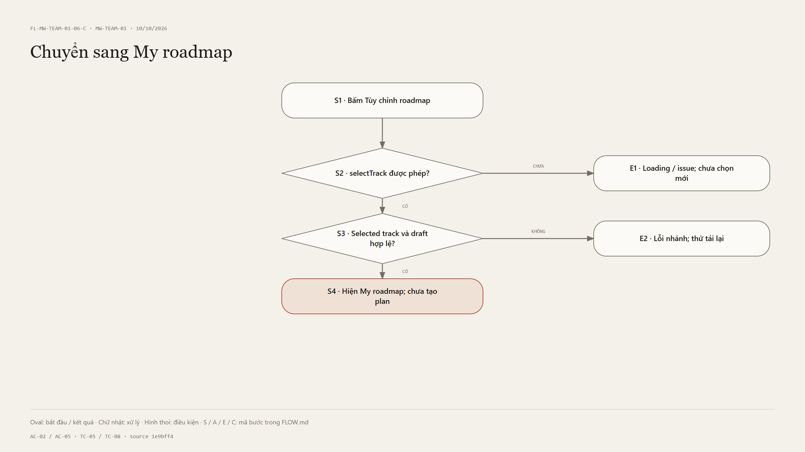

[Bản HTML](diagrams/fl-06-c.html) · [Vector SVG](diagrams/fl-06-c.svg). Tạo/tạo lại plan, hoàn thành, chốt tuần là các task khác; chỉ giữ liên kết TC-05 integration, không nhận thêm sơ đồ nghiệp vụ của các bạn.

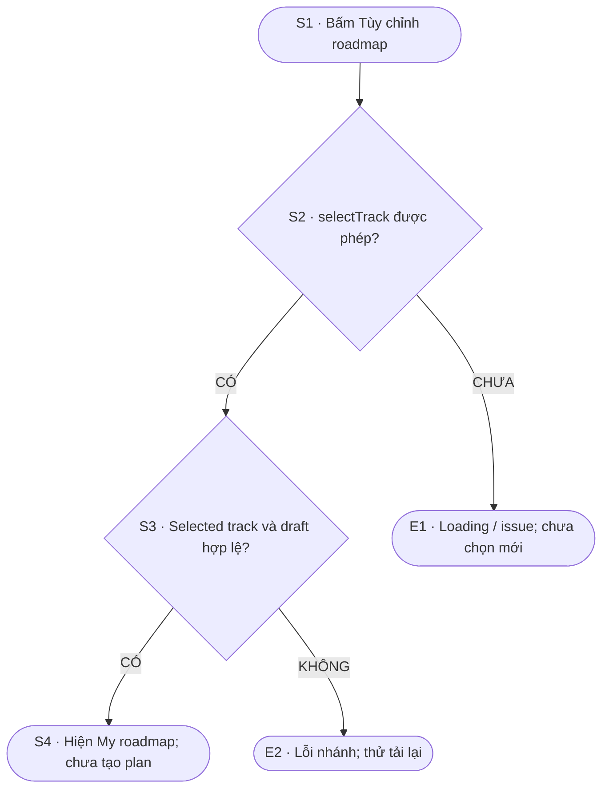
```mermaid
flowchart TD
  S1(["S1 · Bấm Tùy chỉnh roadmap"])
  S2{"S2 · selectTrack được phép?"}
  S3{"S3 · Selected track và draft hợp lệ?"}
  S4(["S4 · Hiện My roadmap; chưa tạo plan"])
  E1(["E1 · Loading / issue; chưa chọn mới"])
  E2(["E2 · Lỗi nhánh; thử tải lại"])
  S1 --> S2
  S2 -->|CÓ| S3
  S3 -->|CÓ| S4
  S2 -->|CHƯA| E1
  S3 -->|KHÔNG| E2
```

Mã bước trong PNG/SVG/HTML và Mermaid giống bảng. A/E/C không xuất hiện trên hình khi chỉ là diễn giải của một bước, lỗi ngoài app, hoặc hành động chưa thực hiện; bảng vẫn nêu điều kiện và trạng thái.

## FL-MW-TEAM-01-07-A — Thử lưu lại candidate đang chờ

- Story / acceptance: US-MW-TEAM-01-07-A / AC-05 · feedback 09/10. Story cụ thể: xem [TASK.md](TASK.md#story-theo-hành-động--bổ-sung-sơ-đồ-1010).
- Actor, trang, sự kiện: sinh viên trong app gốc; Bấm Thử lưu lại. My Plan và Context thật theo feedback.
- Điều kiện trước: Một lần save đã thất bại; unsavedWorkspace giữ đúng candidate. My Plan có thể còn pending local.
- Đầu vào / kiểm tra: Bấm retry ở Path detail/StageDrawer/My Plan hoặc banner. My roadmap conflict chỉ cho tải committed, không hiện nút retry.
- Sau thành công: Nếu commit thành công: candidate trở thành workspace committed, pending shared/local hết; editor dùng tiếp được.
- Giữ khi hủy/lỗi: Disk và history nếu save lại lỗi; không tạo candidate mới, không lặp mutation làm nhân đôi completion.
- Code đối chiếu (baseline trên): `src/app/workspace-controller.ts · retrySave, commit`; `src/app/WorkspacePlan.tsx · banner, onSavePlan`; `src/features/my-plan/MyPlanV2.tsx · persist, pending effect`; `src/features/path-detail/StageDrawer.tsx · apply retry`.
- Test / bằng chứng: [TC-07 / TC-11b / TC-11c](QA_AI_LOG.md); [kiểm tra sơ đồ 10/10](DIAGRAMS_20261010.md). Liên kết test không đồng nghĩa mọi nhánh UI đã chạy lại hôm nay.

### Luồng chính và dữ liệu trước/sau

| Bước | Sinh viên | UI | Domain / persistence | Dữ liệu sau bước |
|---|---|---|---|---|
| S1 | Bấm Thử lưu lại | Khóa khi save đang chạy | retrySave tìm unsavedWorkspace | Không xây thêm mutation |
| S2 | Chờ xử lý | Nếu không candidate thì báo issue | NO_PENDING_SAVE nếu đã bỏ; commit còn chặn loading/saving | Chưa ghi nếu bị từ chối |
| S3 | Chờ lưu lại | saving | saveWorkspace đúng candidate và revision committed hiện tại | Không ghi đè revision writer khác |
| S4 | Nhận kết quả | Success hoặc error | Success: pending=null, dirty=false; error/conflict giữ candidate | Disk commit hoặc nguyên |
| S5 | Tiếp tục chỉnh | MyPlanV2 effect dọn local sau shared banner success; callback sau save chạy đúng | Nếu plan đã đổi khác candidate thì đóng local thao tác cũ và báo | Không còn banner giữ bản đã commit |

### Nhánh thay thế, lỗi và hủy

| Mã | Từ bước | Điều kiện | Thông báo / xử lý | Trạng thái dữ liệu | Test |
|---|---|---|---|---|---|
| E1 | S2 | Không pending / loading / saving | Trả NO_PENDING_SAVE / WORKSPACE_BUSY; không write | Candidate đã bỏ không hồi sinh | TC-11 / TC-11b |
| E2 | S4 | Save tiếp tục lỗi / revision conflict | Giữ candidate và báo lỗi; xác nhận bỏ/tải mới khi conflict | Committed/history nguyên; không báo success | TC-11c |
| A1 | S5 | Retry từ banner thay vì feature | Effect so sánh plan committed với pending.next để dọn local | Không giữ editor khóa bởi bản cũ | TC-11b |
| C1 | S3 | Muốn bỏ khi retry đang saving | UI/callback chặn bỏ; chờ result rồi xác nhận nếu còn pending | Không abort transaction | TC-11b |

### Sơ đồ và mã bước

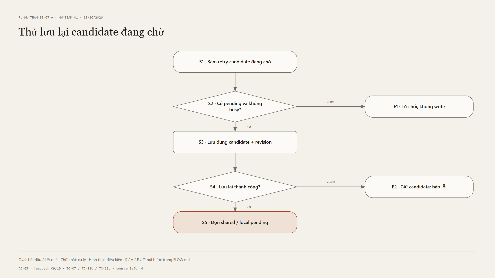

[Bản HTML](diagrams/fl-07-a.html) · [Vector SVG](diagrams/fl-07-a.svg). Retry sau discard thành công trả NO_PENDING_SAVE và không tăng revision. Không đồng nhất việc retry thành công với việc đã thử quota thật.

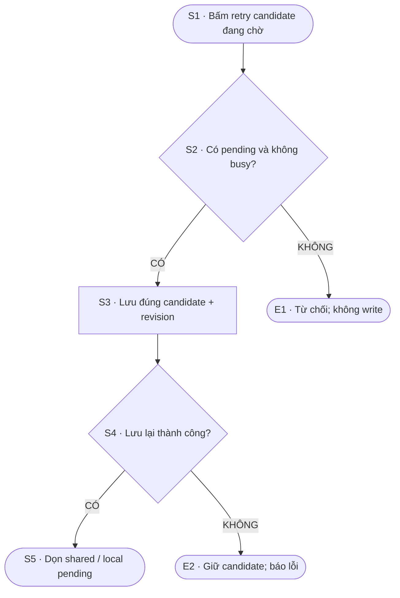
```mermaid
flowchart TD
  S1(["S1 · Bấm retry candidate đang chờ"])
  S2{"S2 · Có pending và không busy?"}
  S3["S3 · Lưu đúng candidate + revision"]
  S4{"S4 · Lưu lại thành công?"}
  S5(["S5 · Dọn shared / local pending"])
  E1(["E1 · Từ chối; không write"])
  E2(["E2 · Giữ candidate; báo lỗi"])
  S1 --> S2
  S2 -->|CÓ| S3
  S3 --> S4
  S4 -->|CÓ| S5
  S2 -->|KHÔNG| E1
  S4 -->|KHÔNG| E2
```

Mã bước trong PNG/SVG/HTML và Mermaid giống bảng. A/E/C không xuất hiện trên hình khi chỉ là diễn giải của một bước, lỗi ngoài app, hoặc hành động chưa thực hiện; bảng vẫn nêu điều kiện và trạng thái.

## FL-MW-TEAM-01-07-B — Xác nhận bỏ candidate My Plan

- Story / acceptance: US-MW-TEAM-01-07-B / AC-05 · feedback 09/10. Story cụ thể: xem [TASK.md](TASK.md#story-theo-hành-động--bổ-sung-sơ-đồ-1010).
- Actor, trang, sự kiện: sinh viên trong app gốc; Bấm Bỏ hoặc đóng editor đang pending. My Plan và Context thật theo feedback.
- Điều kiện trước: Save My Plan thất bại; có pending local và shared candidate tương ứng cùng plan. Không saving/discarding.
- Đầu vào / kiểm tra: Bỏ thay đổi chưa lưu / đóng editor có pending → dialog; chỉ Xác nhận bỏ mới gọi callback.
- Sau thành công: Đọc committed thành công mới dọn shared/local candidate, đóng editor, toast; banner hết, retry không ghi.
- Giữ khi hủy/lỗi: Committed plan, progress/history, revision mới nhất của writer khác. Không reset, write hay xóa database.
- Code đối chiếu (baseline trên): `src/features/my-plan/MyPlanV2.tsx · dismiss, discard, confirmDiscard`; `src/app/WorkspacePlan.tsx · onDiscardPendingPlan`; `src/app/workspace-controller.ts · discardPendingSave, load(true)`.
- Test / bằng chứng: [TC-11 / TC-11b / TC-11c](QA_AI_LOG.md); [kiểm tra sơ đồ 10/10](DIAGRAMS_20261010.md). Liên kết test không đồng nghĩa mọi nhánh UI đã chạy lại hôm nay.

### Luồng chính và dữ liệu trước/sau

| Bước | Sinh viên | UI | Domain / persistence | Dữ liệu sau bước |
|---|---|---|---|---|
| S1 | Bấm Bỏ hoặc đóng editor đang pending | Mở dialog xác nhận; candidate chưa bị xóa | Chưa gọi persistence | Shared/local pending còn |
| S2 | Chọn Xác nhận bỏ | Giữ dialog nếu chọn giữ/Escape | Không mutation khi chưa xác nhận | C1 giữ candidate để retry |
| S3 | Chờ bỏ | Khóa nút khi discarding | WorkspacePlan so ID/JSON với pending; controller kiểm tra reference + loading/saving | Callback stale/busy không được bỏ |
| S4 | Chờ đọc bản lưu | Đang bỏ thay đổi… | load(true) → persistence.loadWorkspace; success tải committed mới nhất kể cả conflict | Không write/reset; read lỗi giữ candidate |
| S5 | Quay My Plan | Success mới closeEditor, notice/toast; banner biến mất | Shared pending=null, dirty=false; local dọn; retrySave trả NO_PENDING_SAVE | Committed/history giữ; không hồi sinh bản đã bỏ |

### Nhánh thay thế, lỗi và hủy

| Mã | Từ bước | Điều kiện | Thông báo / xử lý | Trạng thái dữ liệu | Test |
|---|---|---|---|---|---|
| C1 | S2 | Giữ thay đổi / Escape / đóng xác nhận | Chỉ đóng dialog xác nhận | Candidate local/shared còn; chưa read/write | TC-11 |
| E1 | S3 | Saving/loading hoặc mismatch local/shared/reference | WORKSPACE_BUSY / STALE_PENDING_PLAN / STALE_PENDING_SAVE; báo lỗi | Không xóa candidate hiện tại; cần xác nhận lại bản đúng | TC-11b |
| E2 | S4 | Load lỗi / exception | Không báo đã bỏ; giữ pending, thông báo lỗi và có thể thử lại | Không write và không xóa lịch sử | TC-11 |
| A1 | S4 | Trước đó revision conflict | Đọc committed mới nhất của writer khác; giữ history của bản đó | Không ghi đè revision mới | TC-11c |

### Sơ đồ và mã bước

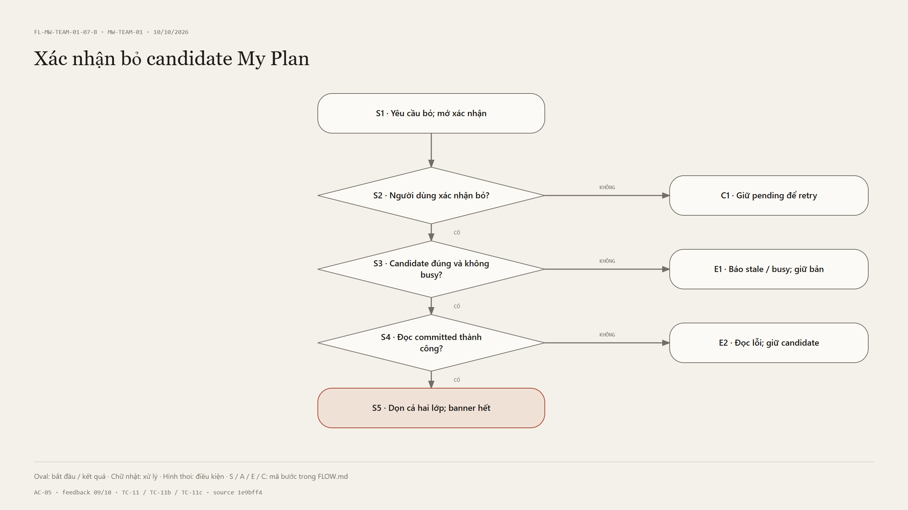

[Bản HTML](diagrams/fl-07-b.html) · [Vector SVG](diagrams/fl-07-b.svg). Thay thế hai sequence minh họa cũ bằng một flowchart đủ xác nhận/hủy/guard/read failure. TC-12 giữ ngày khi ô tuần tạm trống vẫn thuộc feedback QA; không phát sinh sơ đồ chốt tuần ngoài task Hân.

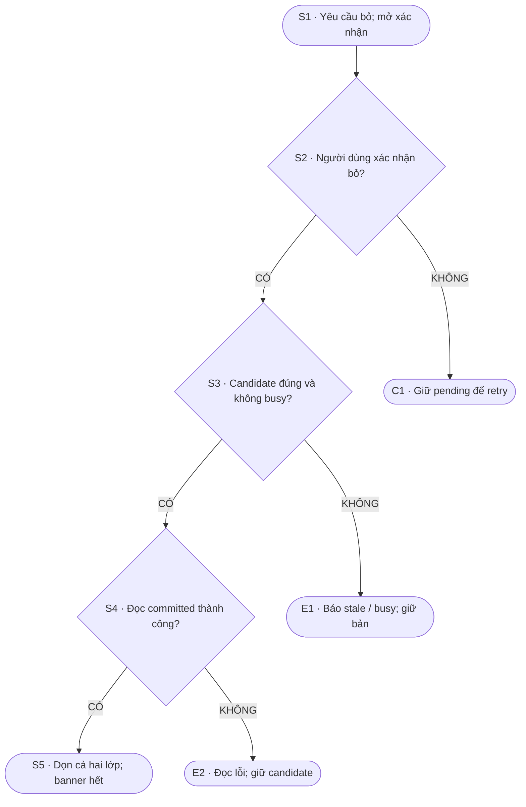
```mermaid
flowchart TD
  S1(["S1 · Yêu cầu bỏ; mở xác nhận"])
  S2{"S2 · Người dùng xác nhận bỏ?"}
  S3{"S3 · Candidate đúng và không busy?"}
  S4{"S4 · Đọc committed thành công?"}
  S5(["S5 · Dọn cả hai lớp; banner hết"])
  C1(["C1 · Giữ pending để retry"])
  E1(["E1 · Báo stale / busy; giữ bản"])
  E2(["E2 · Đọc lỗi; giữ candidate"])
  S1 --> S2
  S2 -->|CÓ| S3
  S3 -->|CÓ| S4
  S4 -->|CÓ| S5
  S2 -->|KHÔNG| C1
  S3 -->|KHÔNG| E1
  S4 -->|KHÔNG| E2
```

Mã bước trong PNG/SVG/HTML và Mermaid giống bảng. A/E/C không xuất hiện trên hình khi chỉ là diễn giải của một bước, lỗi ngoài app, hoặc hành động chưa thực hiện; bảng vẫn nêu điều kiện và trạng thái.

## Ghi chú lịch sử feedback

Luồng retry/discard trước đây nằm trong FL-06 gộp; nay chuyển thành FL-07-A/B để không trộn với bookmark/navigation. TC-12 giữ ngày khi tuần tạm trống → tuần mới vẫn giữ ngày; chỉ submit backlog mới dayIndex=null. Bằng chứng ngày 09/10 và patch Chung Hiếu được giữ trong [FEEDBACK_20261009.md](FEEDBACK_20261009.md); lượt tài liệu này không sửa parser/My Plan và không nhận thêm nghiệp vụ task MW-TEAM-03.
