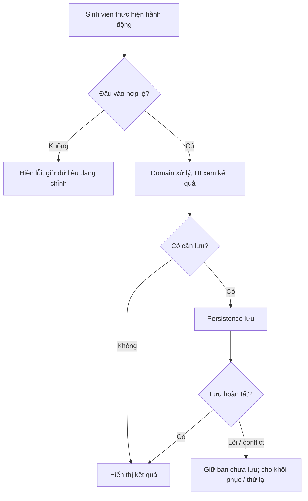

# Luồng chi tiết — <TASK-ID>

Copy khối dưới cho **từng hành động**, đặt mã duy nhất `FL-<TASK-ID>-01`, `02`... Không thay bằng một luồng chung cho toàn app.

## FL-<TASK-ID>-01 — <Tên hành động>

- Story / acceptance: US-… / AC-…
- Actor, trang và sự kiện bắt đầu:
- Điều kiện trước (data/branch/plan/quyền/trạng thái):
- Dữ liệu đầu vào và kiểm tra:
- Kết quả sau thành công:
- Dữ liệu phải giữ khi hủy/lỗi:

| Bước | Sinh viên | UI | Domain / persistence | Dữ liệu sau bước |
|---|---|---|---|---|
| S1 | <hành động> | <phản hồi> | <xử lý> | <giữ/đổi> |
| S2 | | | | |

### Nhánh thay thế, lỗi và hủy

| Mã | Xuất phát từ bước | Điều kiện | Thông báo / xử lý | Trạng thái dữ liệu | Test |
|---|---|---|---|---|---|
| A1 | S… | <thay thế> | | | TC-… |
| E1 | S… | <input/lưu lỗi> | | | TC-… |
| C1 | S… | <hủy/đóng> | | | TC-… |

### Sơ đồ

Ví dụ ký hiệu; sửa theo hành động thực tế, không dùng nguyên mẫu làm đặc tả đã kiểm chứng:

Ghi ánh xạ mã bước trên hình với bảng. Nếu có xác nhận, thêm nhánh hủy trước mutation. Có thể đính kèm hình từ diagram-design/archify; bảng nghiệp vụ vẫn phải đọc được.
