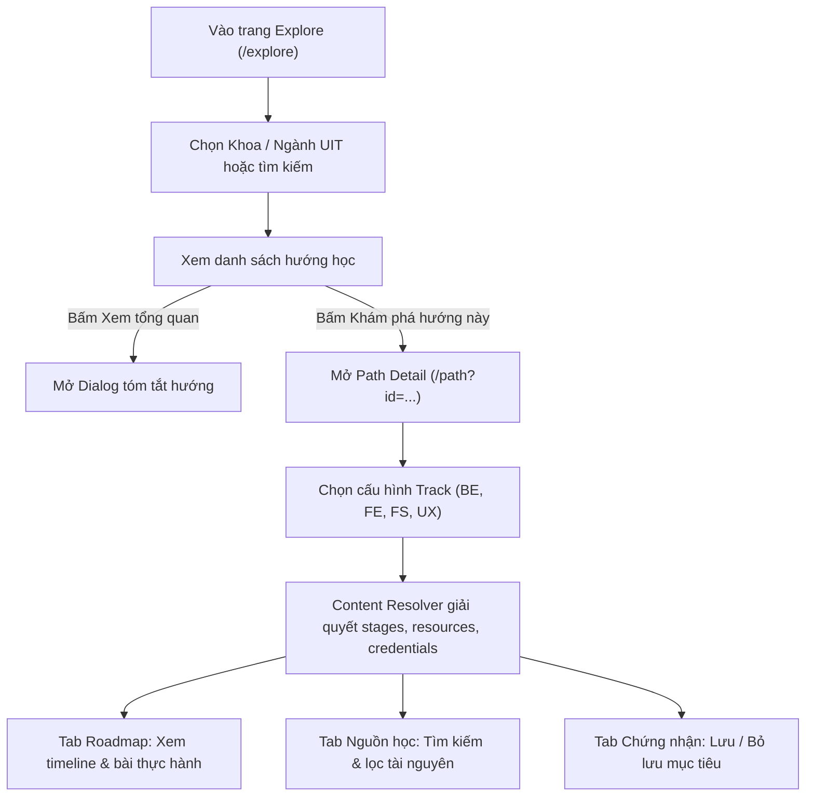

# Luồng chi tiết — MW-TEAM-01 (Khám phá, chi tiết hướng và nội dung Web/UX)

**Người thực hiện:** Nguyễn Thị Quỳnh Hân (`QuynhHan486`)
**Mục tiêu:** Đặc tả 6 hành vi tương tác độc lập từ Explore đến Path Detail, giải quyết nội dung qua Content Resolver thuần và xử lý an toàn các trạng thái lỗi/hủy.

---

## FL-MW-TEAM-01-01 — Chọn ngành đào tạo và khám phá theo khoa

- **Story / acceptance:** US-MW-TEAM-01-01 / AC-01
- **Actor, trang và sự kiện bắt đầu:** Sinh viên tại trang `/explore`, thao tác tại thanh `profile-strip` hoặc dropdown "Khám phá theo khoa".
- **Điều kiện trước:** Trạng thái ứng dụng đã tải, sinh viên có thể đã có hoặc chưa chọn ngành học trong hồ sơ.
- **Dữ liệu đầu vào và kiểm tra:**
  - `facultyId`: mã khoa hợp lệ thuộc 6 khoa (`se`, `cs`, `is`, `it`, `nc`, `ce`).
  - `majorId`: mã ngành hợp lệ thuộc 12 ngành UIT hoặc rỗng.
- **Kết quả sau thành công:** Giao diện cập nhật danh sách ngành tương ứng theo khoa, bộ lọc gợi ý hướng gần/mở rộng cập nhật theo `majorId` mà không làm thay đổi các kế hoạch học tập đang lưu.
- **Dữ liệu phải giữ khi hủy/lỗi:** Giữ nguyên giá trị `major` và `activePlanId` trước thao tác.

| Bước | Sinh viên | UI (Explore) | Domain / persistence | Dữ liệu sau bước |
|---|---|---|---|---|
| S1 | Chọn một Khoa tại dropdown "Khoa hiện tại" | Dropdown "Ngành đang học" lọc danh sách ngành thuộc khoa vừa chọn | Hàm `getMajorsByDepartment(deptId)` lọc danh sách ngành | Cập nhật `major` sang ngành đầu tiên của khoa |
| S2 | Bấm chọn ngành cụ thể từ dropdown | Thẻ "Phạm vi ngành đang học" hiển thị ghi chú đối chiếu kiến thức | `update({ major: majorId })` lưu vào state cục bộ | `state.major = majorId` |
| S3 | Tích chọn checkbox "Chỉ hướng gần / mở rộng từ ngành tôi" | Lưới hướng học chỉ hiển thị các hướng có quan hệ gần (primary) hoặc mở rộng (related) | Lọc qua ma trận quan hệ ngành | `nearOnly = true`, danh sách hướng thu gọn |

### Nhánh thay thế, lỗi và hủy

| Mã | Xuất phát từ bước | Điều kiện | Thông báo / xử lý | Trạng thái dữ liệu | Test |
|---|---|---|---|---|---|
| A1 | S1 | Sinh viên chọn "Chưa chọn / Bỏ qua" | Dropdown ngành reset về rỗng, tắt checkbox `nearOnly` | `state.major = ''`, hiển thị tất cả 18 hướng | TC-MW-TEAM-01-01 |
| A2 | S3 | Bấm "Xem hướng của [Ngành]" trong Bảng tra cứu ma trận | Tự động chọn ngành, bật `nearOnly=true` và cuộn đến danh sách hướng | `state.major` cập nhật theo hàng được bấm | TC-MW-TEAM-01-01 |
| C1 | S1 | Người dùng không chọn và tải lại trang | Giữ nguyên ngành đã lưu trong localStorage | Không có đột biến dữ liệu | TC-MW-TEAM-01-05 |

---

## FL-MW-TEAM-01-02 — Tìm kiếm, lọc nhóm hướng học và xử lý kết quả rỗng

- **Story / acceptance:** US-MW-TEAM-01-01 / AC-01, AC-03
- **Actor, trang và sự kiện bắt đầu:** Sinh viên nhập từ khóa tại ô tìm kiếm hoặc chọn nhóm ngành tại toolbar `/explore`.
- **Điều kiện trước:** Đang ở trang `/explore`.
- **Dữ liệu đầu vào và kiểm tra:** Chuỗi tìm kiếm `pathQuery` và nhóm `pathCategory` ('all', 'software', 'data', 'infrastructure', 'design', 'business').
- **Kết quả sau thành công:** Danh sách thẻ hướng học cập nhật thời gian thực, có nhãn trạng thái tương ứng.
- **Dữ liệu phải giữ khi hủy/lỗi:** Bộ lọc xóa bỏ khi bấm "Xóa bộ lọc hướng học".

| Bước | Sinh viên | UI | Domain / logic | Dữ liệu sau bước |
|---|---|---|---|---|
| S1 | Nhập từ khóa tìm kiếm (ví dụ: "React") | Ô tìm kiếm cập nhật ký tự | Lọc danh sách hướng khớp tên, tóm tắt hoặc thẻ tags | `pathQuery = "React"` |
| S2 | Chọn nhóm hướng (ví dụ: "Thiết kế & truyền thông") | Lưới chỉ hiển thị các thẻ thuộc danh mục đã chọn | Lọc `path.category === pathCategory` | Danh sách hiển thị thu gọn |
| S3 | Bấm nút "Khám phá hướng này" trên thẻ | Chuyển hướng sang `/path?id=<pathId>` | React Router điều hướng URL | URL chuyển sang `/path?id=...` |

### Nhánh thay thế, lỗi và hủy

| Mã | Xuất phát từ bước | Điều kiện | Thông báo / xử lý | Trạng thái dữ liệu | Test |
|---|---|---|---|---|---|
| E1 | S1 | Không có hướng nào khớp với từ khóa tìm kiếm | Hiển thị khối `empty-inline`: "Chưa có hướng học khớp các bộ lọc." kèm nút xóa bộ lọc | `visiblePaths.length === 0` | TC-MW-TEAM-01-02 |
| A1 | E1 | Sinh viên bấm "Xóa bộ lọc hướng học" | Reset `pathQuery = ''`, `pathCategory = 'all'`, `nearOnly = false` | Hiển thị lại toàn bộ các hướng | TC-MW-TEAM-01-02 |

---

## FL-MW-TEAM-01-03 — Chọn và chuyển đổi track (kể cả 9 cặp Full-stack)

- **Story / acceptance:** US-MW-TEAM-01-01, US-MW-TEAM-01-02 / AC-02, AC-04
- **Actor, trang và sự kiện bắt đầu:** Sinh viên tại trang `/path?id=<pathId>`, thao tác tại khối chọn cấu hình (`stack-chooser`).
- **Điều kiện trước:** `pathId` thuộc một trong các hướng được hỗ trợ (`backend`, `frontend`, `fullstack`, `ux`).
- **Dữ liệu đầu vào và kiểm tra:** `trackId` hợp lệ (ví dụ: `frontend.react`, `fullstack.angular-java`, `ux.product`).
- **Kết quả sau thành công:** Hàm `resolveTrackContent` giải quyết đầy đủ stages, resources, credentials tương ứng với track mới; timeline Roadmap hiển thị đúng chặng và thứ tự tiên quyết.
- **Dữ liệu phải giữ khi hủy/lỗi:** Nếu track không tồn tại, trả về kết quả lỗi mã `not_found` mà không làm vỡ giao diện.

| Bước | Sinh viên | UI | Domain / logic | Dữ liệu sau bước |
|---|---|---|---|---|
| S1 | Bấm chọn nút nhánh (ví dụ: "Angular + Java" trong Fullstack) | Nút được đánh dấu active (viền rust, dấu tích ✓), hiện thông báo Toast | Cập nhật `selectedTrackId = 'fullstack.angular-java'` | State track cục bộ đổi |
| S2 | UI yêu cầu nội dung chặng | Tải và vẽ lại cây timeline Roadmap với 23 chặng học | Gọi `resolveTrackContent(packs, trackId)`, gộp chặng FE + BE + tích hợp | Dữ liệu chặng được nạp chuẩn xác |
| S3 | Kiểm tra khối mục tiêu dự án | Hiển thị tiêu chí Capstone: "Hệ thống Quản lý Doanh nghiệp Toàn diện (Angular + Java)" | Đọc `resolved.track.portfolio` | Render đúng mục tiêu đầu ra |

### Nhánh thay thế, lỗi và hủy

| Mã | Xuất phát từ bước | Điều kiện | Thông báo / xử lý | Trạng thái dữ liệu | Test |
|---|---|---|---|---|---|
| A1 | S1 | Chọn hướng Backend (`node`, `python`, `java`) | Đồng bộ với `state.stack` và `update(stackPatch(...))` để tương thích My Roadmap | `state.stack` cập nhật an toàn | TC-MW-TEAM-01-03 |
| E1 | S2 | `trackId` không hợp lệ hoặc thiếu chặng | Hàm trả về `{ ok: false, code: 'validation' }`, UI hiển thị thông báo lỗi | Không render dữ liệu hỏng | TC-MW-TEAM-01-03 |

---

## FL-MW-TEAM-01-04 — Mở chặng học, lọc nguồn và xem bài thực hành

- **Story / acceptance:** US-MW-TEAM-01-01 / AC-02, AC-03
- **Actor, trang và sự kiện bắt đầu:** Sinh viên bấm vào một chặng trong timeline tại tab "Roadmap" hoặc mở tab "Nguồn học".
- **Điều kiện trước:** Track đã được giải quyết nội dung thành công.
- **Dữ liệu đầu vào và kiểm tra:** `stageId` hợp lệ; bộ lọc tài nguyên (`free`, `vi`, `en`).
- **Kết quả sau thành công:** Mở hộp thoại chi tiết chặng (`inspectStage`) hiển thị mục tiêu đầu ra, bài tập thực hành kèm thời lượng phút và tiêu chí nghiệm thu rõ ràng.
- **Dữ liệu phải giữ khi hủy/lỗi:** Đóng dialog không làm thay đổi trạng thái chọn của các chặng khác.

| Bước | Sinh viên | UI | Domain / logic | Dữ liệu sau bước |
|---|---|---|---|---|
| S1 | Bấm vào nút chặng trên timeline Roadmap | Mở Dialog chi tiết chặng bên phải màn hình | Đọc `stage.work`, `stage.outcome`, `stage.resourceIds` | `inspectStage = stage` |
| S2 | Xem danh sách bài tập thực hành | Hiển thị từng bài: Tên bài, thời lượng phút (vd: 120 phút), các gạch đầu dòng nghiệm thu | Duyệt danh sách `WorkTemplate` | Người dùng nắm rõ yêu cầu đầu ra |
| S3 | Bấm nút "Đóng" hoặc nút X góc trên | Hộp thoại đóng lại mượt mà | Reset `inspectStage = null` | Trở lại danh sách Roadmap |

### Nhánh thay thế, lỗi và hủy

| Mã | Xuất phát từ bước | Điều kiện | Thông báo / xử lý | Trạng thái dữ liệu | Test |
|---|---|---|---|---|---|
| A1 | S1 | Sinh viên chuyển sang tab "Nguồn học" và tìm kiếm từ khóa | Lưới tài nguyên lọc theo tên/nhà cung cấp | `filteredResources` cập nhật | TC-MW-TEAM-01-04 |
| E1 | A1 | Bộ lọc không có nguồn học phù hợp | Hiển thị khối `empty-inline`: "Chưa có nguồn học khớp với tìm kiếm." kèm nút "Xóa bộ lọc" | Không hiển thị thẻ rỗng | TC-MW-TEAM-01-04 |

---

## FL-MW-TEAM-01-05 — Mở roadmap và tài nguyên chính thức ở tab mới

- **Story / acceptance:** US-MW-TEAM-01-01 / AC-03
- **Actor, trang và sự kiện bắt đầu:** Sinh viên bấm vào các nút liên kết Roadmap tham khảo hoặc tiêu đề tài nguyên học.
- **Điều kiện trước:** Các URL tài nguyên và roadmap đã qua kiểm tra cấu trúc HTTPS.
- **Dữ liệu đầu vào và kiểm tra:** Thuộc tính `href` là URL hợp lệ có giao thức `https:`, gắn `target="_blank"` và `rel="noreferrer noopener"`.
- **Kết quả sau thành công:** Trình duyệt mở tab mới dẫn đến website của đơn vị cung cấp (roadmap.sh, MDN, React.dev, Coursera...), không điều hướng trang MajorWeave hiện tại.
- **Dữ liệu phải giữ khi hủy/lỗi:** Tab MajorWeave giữ nguyên 100% ngữ cảnh và trạng thái cuộn.

| Bước | Sinh viên | UI | Trình duyệt | Dữ liệu sau bước |
|---|---|---|---|---|
| S1 | Bấm nút "Frontend trên roadmap.sh" | Component `External` chặn sự kiện điều hướng nội bộ | Trình duyệt kích hoạt mở cửa sổ/tab mới với URL đích | Giữ nguyên trạng thái app |
| S2 | Trở lại tab MajorWeave | Trang web vẫn đang ở đúng vị trí cuộn và tab đang chọn | Không bị reload trang | Trạng thái nguyên vẹn |

---

## FL-MW-TEAM-01-06 — Lưu/bỏ lưu mục tiêu chứng nhận nghề nghiệp

- **Story / acceptance:** US-MW-TEAM-01-01 / AC-03, AC-05
- **Actor, trang và sự kiện bắt đầu:** Sinh viên mở tab "Chứng nhận" tại Path Detail và bấm icon bookmark trên thẻ chứng nhận.
- **Điều kiện trước:** Track có danh sách chứng nhận đã khảo sát.
- **Dữ liệu đầu vào và kiểm tra:** `credentialId` hợp lệ thuộc `resolved.credentials`.
- **Kết quả sau thành công:** Icon bookmark đổi trạng thái tô màu / rỗng, mảng `state.credentials` cập nhật, thông báo Toast hiện "Đã lưu mục tiêu chứng nhận" hoặc "Đã bỏ mục tiêu chứng nhận".
- **Dữ liệu phải giữ khi hủy/lỗi:** Nếu lưu trữ thất bại, hoàn tác mảng `credentials` và báo trạng thái chưa lưu.

| Bước | Sinh viên | UI | Persistence | Dữ liệu sau bước |
|---|---|---|---|---|
| S1 | Mở tab "Chứng nhận" | Hiển thị danh sách thẻ chứng nhận tương ứng với track | Đọc `resolved.credentials` | Render đầy đủ thẻ |
| S2 | Bấm nút bookmark trên thẻ chứng nhận | Icon chuyển sang màu gạch (rust), hiển thị Toast | `update({ credentials: [...state.credentials, credId] })` | `state.credentials` chứa ID mới |
| S3 | Bấm lại icon bookmark một lần nữa | Icon trở về trạng thái viền mờ, hiển thị Toast "Đã bỏ mục tiêu chứng nhận" | Lọc bỏ ID khỏi mảng `credentials` | `state.credentials` loại bỏ ID |

### Sơ đồ luồng tổng quát

## Giới hạn đối chiếu code ngày 08/10/2026

Các luồng lưu/chọn nguồn/draft FE/FS/UX là nghiệp vụ đích, chưa được UI thực hiện đầy đủ. My Roadmap còn Backend v1. Xem REVIEW_IMPORT_20261008.md; không lấy flow làm bằng chứng thao tác đã Pass.
