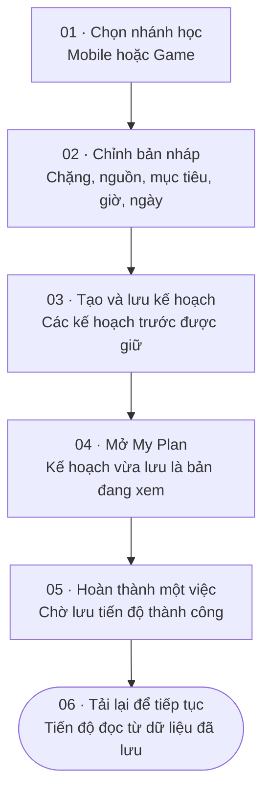
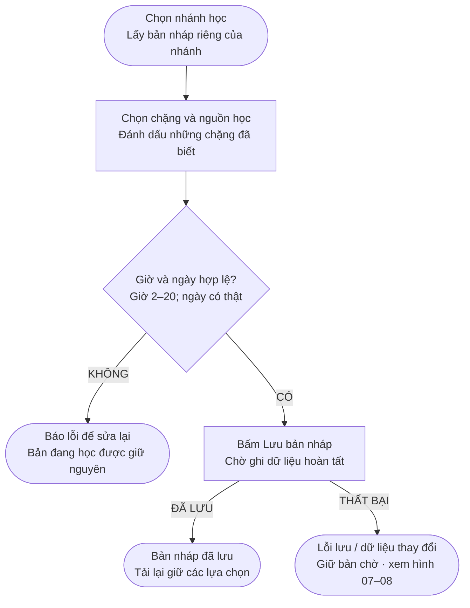
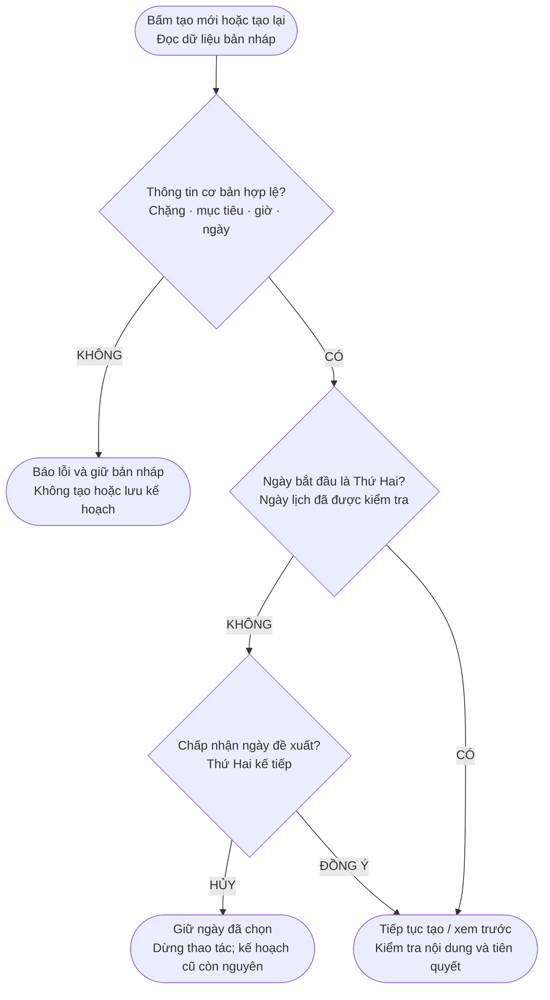
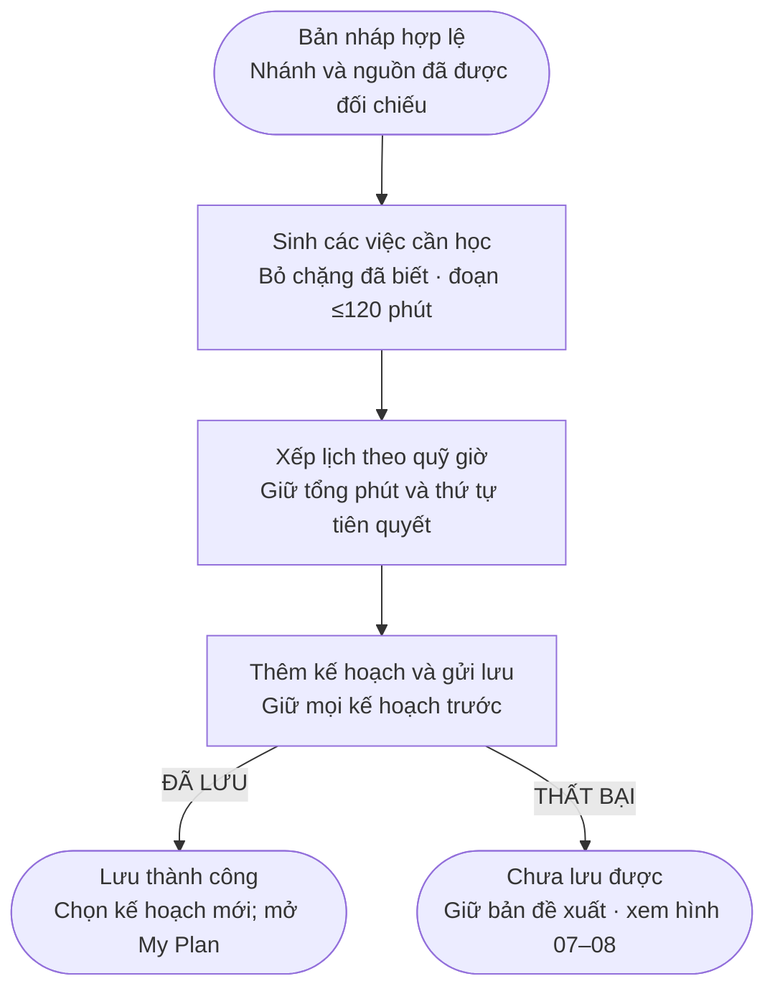
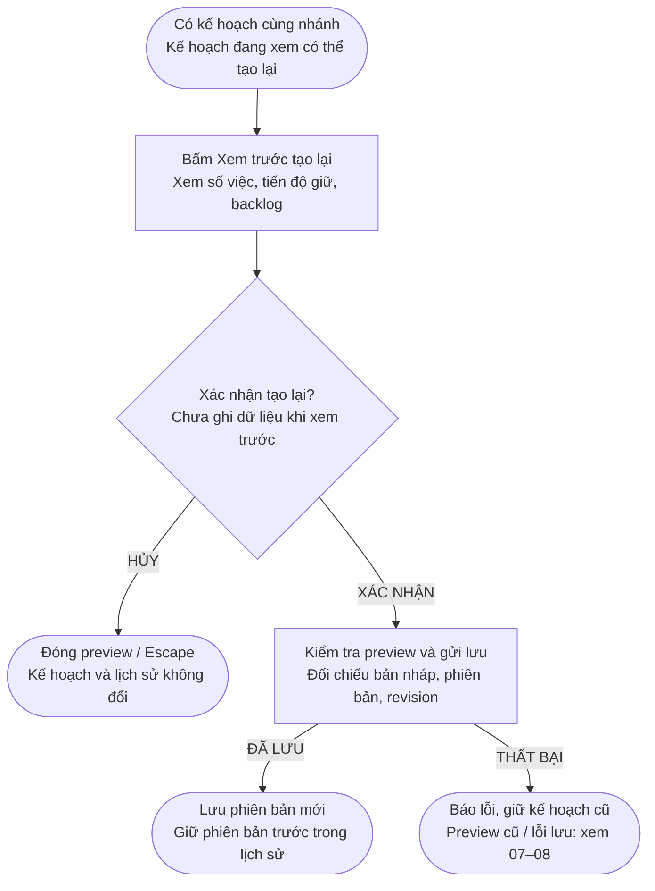
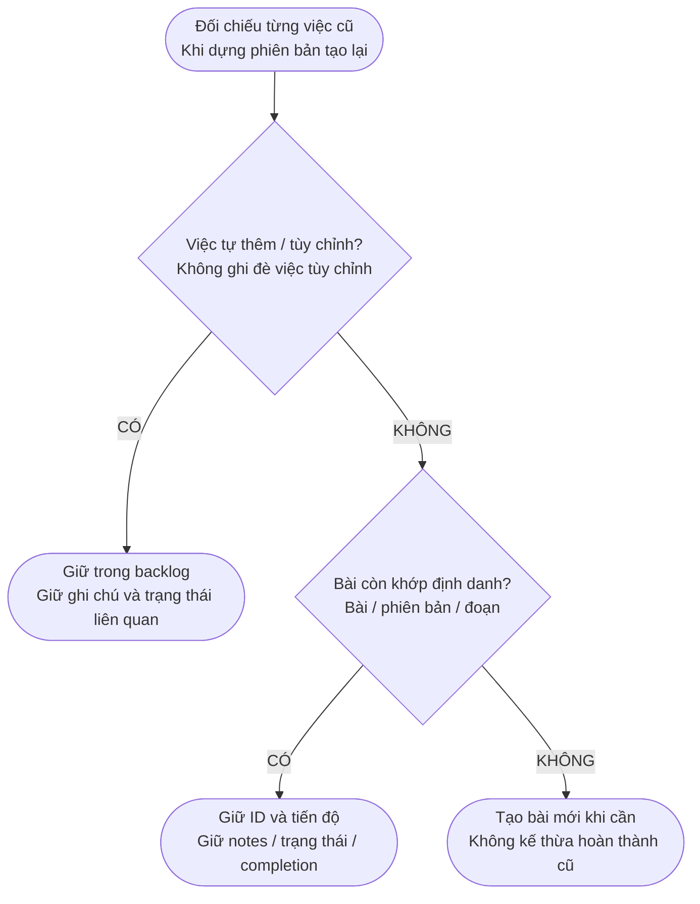
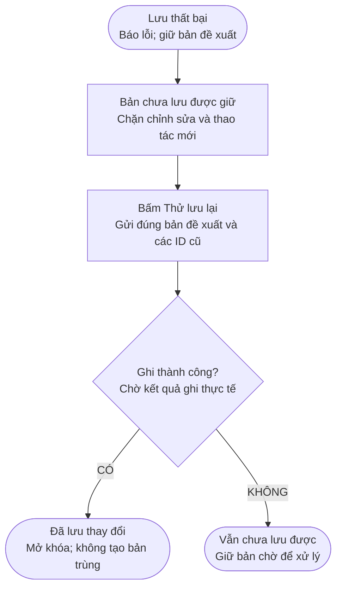
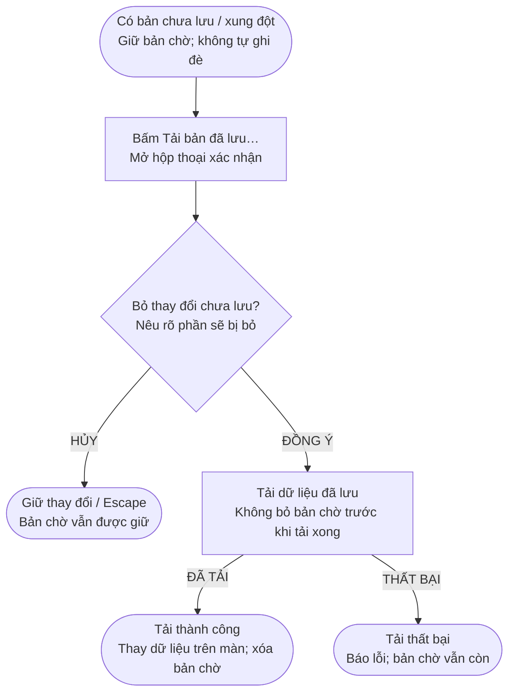

# Sơ đồ luồng tính năng — MW-TEAM-02

Ngày 10/10/2026 · Đối chiếu main `1e9bff4`.

[Mở bộ sơ đồ trực quan](diagrams/flows.html). Có tám hình, mỗi hình tập trung vào một luồng; phần Mermaid bên dưới là nguồn có thể chỉnh sửa.

Phạm vi: Roadmap/Planner của Định. My Plan và persistence được thể hiện ở điểm nối tích hợp, không nhận thành tính năng riêng của MW-TEAM-02.

## 01 — Từ lộ trình đến tiến độ đã lưu

Hành trình chính của người học, từ chọn nhánh đến tải lại tiến độ trong My Plan.

- Sơ đồ tổng quan chỉ mô tả luồng thành công. Các nhánh lỗi, hủy và tạo lại nằm ở các hình sau.
- Bước 01–03 thuộc phần MW-TEAM-02; My Plan và ghi nhận hoàn thành nối với module của Chung Minh Hiếu qua dữ liệu chung.

Đối chiếu: `FL-02-01 → FL-02-06` · `MyRoadmap.tsx` · `MyPlanV2.tsx`.

## 02 — Chỉnh và lưu bản nháp

Chỉnh bản nháp theo nhánh học rồi lưu độc lập với kế hoạch đang học.

- Bản nháp có thể chưa có mục tiêu hoặc chưa đủ chặng tiên quyết. Lưu nháp không phải tạo kế hoạch.
- Thiếu nền tảng được chỉ rõ trên trang; không tự thêm chặng hay tự đánh dấu “đã biết”. Đổi lựa chọn không sửa kế hoạch hiện có.

Đối chiếu: `FL-02-01 / FL-02-02` · `AC-01` · `updateDraft / saveDraft`.

## 03 — Kiểm tra đầu vào và ngày bắt đầu

Kiểm tra dữ liệu trước khi tạo mới hoặc xem trước tạo lại, và xin xác nhận nếu cần đổi ngày sang Thứ Hai.

- Xác nhận mới cập nhật ngày. Hủy hoặc Escape giữ ngày cũ và không tiếp tục tạo.
- Planner kiểm tra nguồn thuộc chặng, thứ tự và tiên quyết; chọn tất cả “đã biết” sẽ không sinh kế hoạch rỗng.

Đối chiếu: `FL-02-03` · `AC-01` · `request / confirmMonday / validateDraft`.

## 04 — Tạo một kế hoạch mới

Sinh lịch theo thời gian học, thêm kế hoạch mới và chỉ thông báo thành công sau khi lưu xong.

- Tạo mới mặc định thêm một kế hoạch độc lập, kể cả khi đã có kế hoạch cùng nhánh. Ngày cụ thể trong tuần chưa được tự gán.
- Trong lúc lưu, chặn chỉnh sửa và gửi lặp. Không báo “đã lưu” hoặc chuyển kế hoạch đang xem trước khi ghi thành công.

Đối chiếu: `FL-02-04` · `AC-02 / AC-03` · `generatePlan / createPlan / commit`.

## 05 — Xem trước và tạo lại kế hoạch

Xem thay đổi trước khi xác nhận tạo lại một kế hoạch cùng nhánh, giữ bản cũ khi hủy hoặc xảy ra lỗi.

- UI chỉ cho tạo lại kế hoạch đang xem cùng nhánh. Muốn học nhánh khác thì tạo kế hoạch mới.
- Sửa bản nháp làm preview cũ hết hiệu lực. Tiến độ được giữ theo quy tắc hình 06, không sao chép hoàn thành sang bài đã đổi nghĩa.

Đối chiếu: `FL-02-05` · `AC-04` · `previewRegeneration / confirmRegeneration`.

## 06 — Giữ việc tùy chỉnh và tiến độ

Phân biệt việc do người học chỉnh với bài từ nội dung mẫu để giữ đúng tiến độ khi tạo lại.

- Đây là quy tắc giữ việc cũ; lịch mới vẫn được sinh từ các chặng cần học. Việc tùy chỉnh không thay thế bài mẫu mới.
- Các việc cũ không còn trong lịch mới vẫn được giữ trong phiên bản lịch sử. Không sửa lịch sử hay nhân đôi bản ghi hoàn thành.

Đối chiếu: `FL-02-06` · `AC-04` · `regeneratePlan / workId / revision / segment`.

## 07 — Thử lại khi lưu thất bại

Giữ đúng bản chưa lưu và thử lại mà không tạo thêm kế hoạch trùng.

- Nếu vẫn là lỗi lưu, có thể thử lại hoặc chọn “Tải bản đã lưu…” rồi xác nhận bỏ bản chờ theo hình 08.
- Nếu dữ liệu đã thay đổi ở tab khác, UI không hiện nút thử lưu lại để tránh ghi đè bản mới hơn. Khi đó đi thẳng đến hình 08.

Đối chiếu: `FL-02-04 / FL-02-05` · `AC-03` · `retrySave / commit`.

## 08 — Tải bản đã lưu và xử lý xung đột

Xin xác nhận trước khi bỏ dữ liệu chưa lưu; xung đột ở tab khác không được tự ghi đè.

- Xung đột thường xuất hiện khi tab khác lưu phiên bản mới hơn. Tải lại lấy phiên bản đã lưu thay cho dữ liệu đang chỉnh trên màn này.
- Trong lúc đang lưu, thao tác tải lại hoặc bỏ dữ liệu bị chặn. Không reset dữ liệu về mặc định để né lỗi.

Đối chiếu: `FL-02-04 / FL-02-05` · `AC-03` · `reloadWorkspace(true) / revision`.
