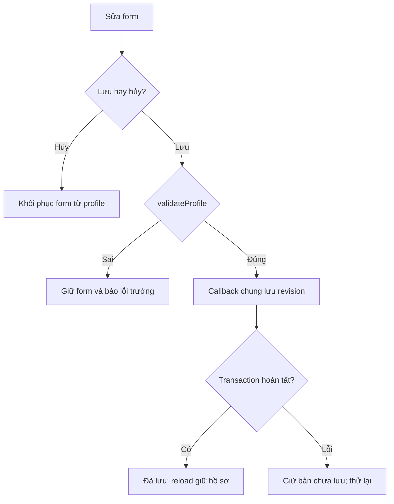
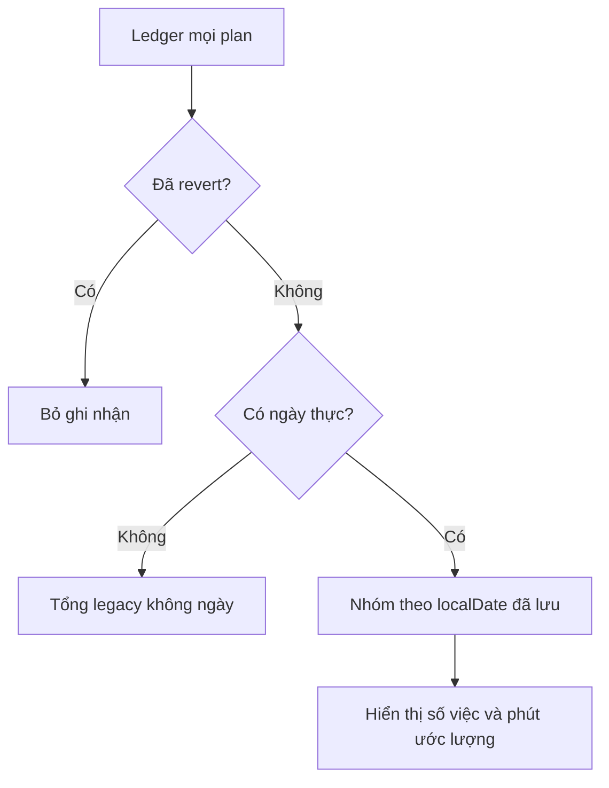
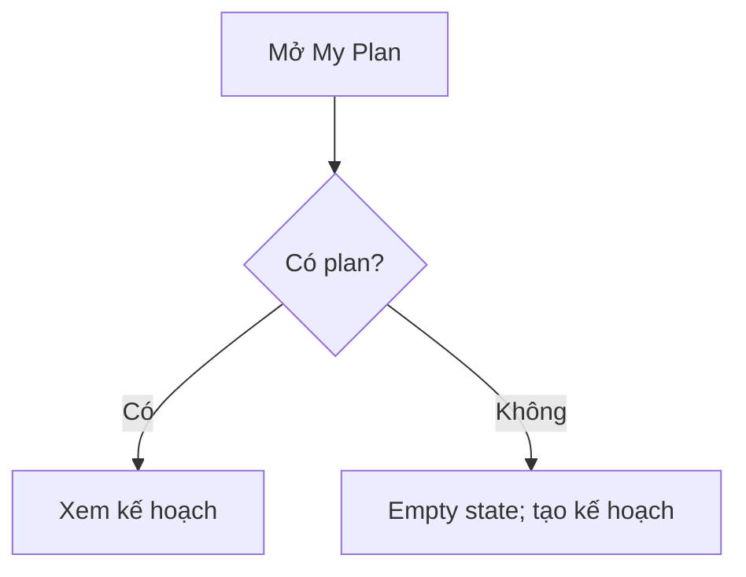
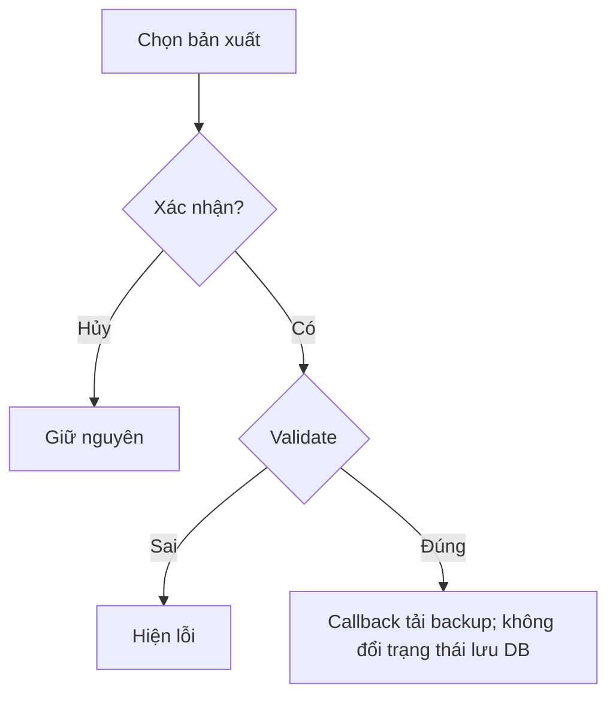
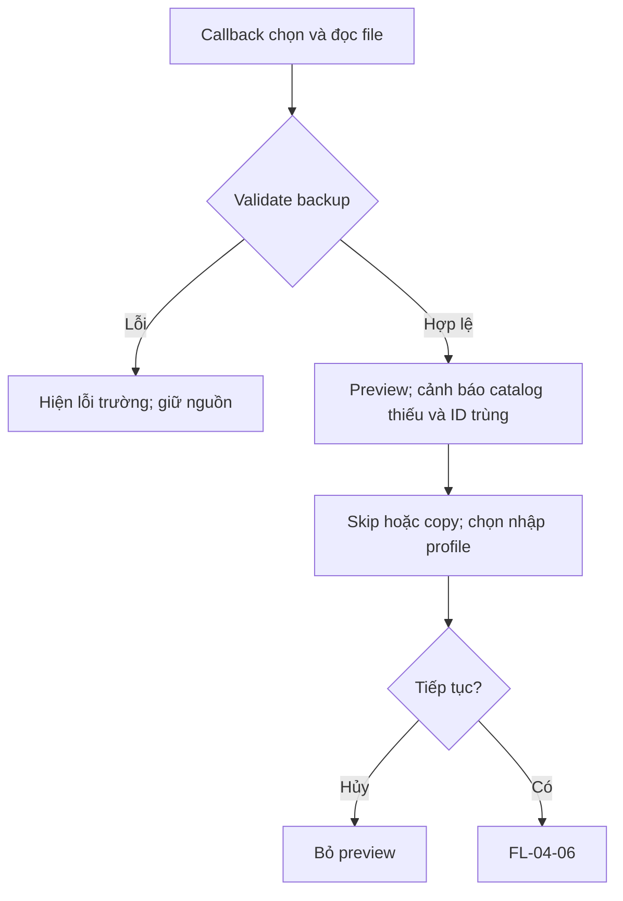
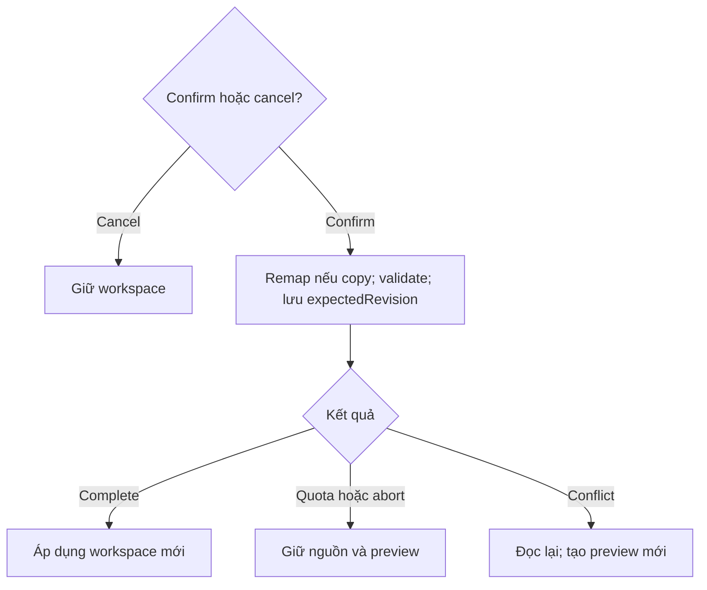
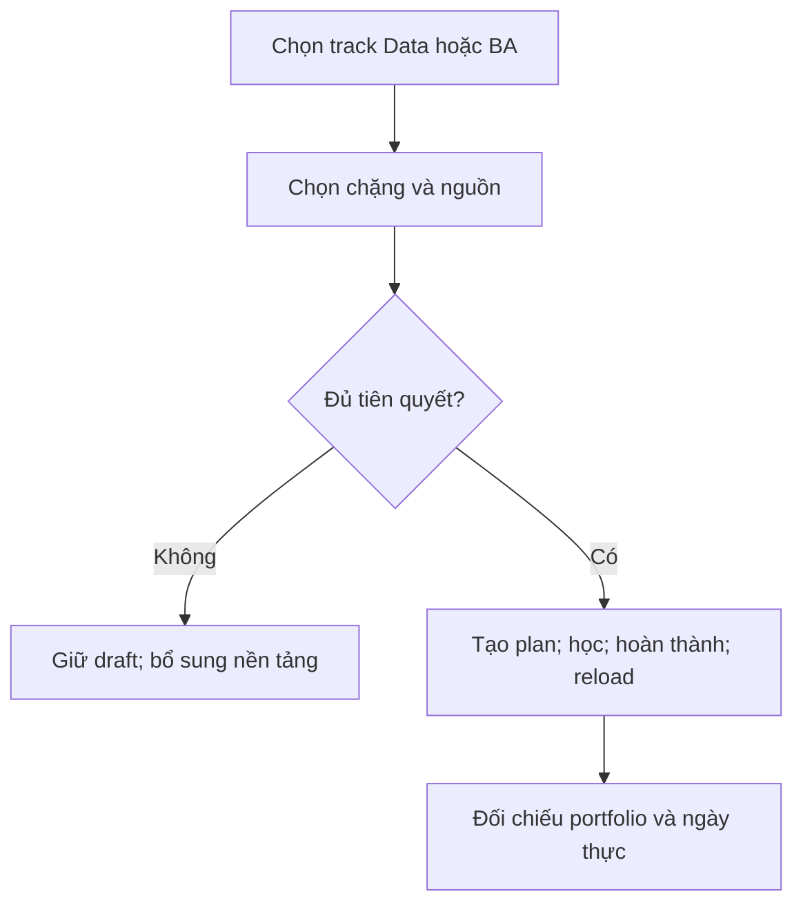

# Luồng chi tiết — MW-TEAM-04

07/10/2026. Mã ngắn FL-04-NN tương ứng FL-MW-TEAM-04-NN. Luồng v2 là đặc tả bàn giao, chưa tuyên bố chạy trên app v1.

## FL-04-01 — Sửa và hủy hồ sơ

US-04-01 / AC-01 / TC-P01–P05. Actor: sinh viên tại Profile; workspace đã load. Input: tên tối đa 60 ký tự (rỗng cho phép), ngành thuộc catalog hoặc chưa chọn, timezone IANA.

| Bước | Sinh viên / UI | Domain / persistence | Dữ liệu |
|---|---|---|---|
| S1 | Mở form, sửa trường | Copy profile vào draft form | Workspace giữ nguyên |
| S2 | Bấm lưu | validateProfile; callback chung lưu với revision | Chỉ patch profile |
| S3 | Nhận kết quả | Success chỉ sau transaction complete | Reload có profile đã lưu |

| Nhánh | Từ | Xử lý | Dữ liệu / test |
|---|---|---|---|
| A1 | S2 | Tên rỗng hiển thị Người học | Giữ chuỗi rỗng / P01 |
| E1 | S2 | Ngành/timezone sai: lỗi tại trường | Giữ draft và workspace / P02 |
| E2 | S3 | Lỗi/quota/conflict: chưa lưu, cho thử lại | Giữ bản chưa lưu / P04 |
| C1 | S1 | Hủy: reset draft bằng profile hiện hành | Không gọi update / P03 |

V1 hiện tại chỉ update State qua callback void: UI nói đã cập nhật và hướng người dùng xem chỉ báo lưu; không tuyên bố transaction v2 thành công.

## FL-04-02 — Xem nhịp học

US-04-02 / AC-02 / TC-A01–A06. Input: các plan current/history/archived và ledger đã validate. Output chỉ là view; không có mutation.

| Bước | UI | Domain | Dữ liệu |
|---|---|---|---|
| S1 | Mở Profile | summarizeActivity đọc completions của mỗi plan đúng một lần | Không đọc task snapshot để cộng |
| S2 | Xem ngày | Bỏ reverted; nhóm localDate; cộng estimatedMinutes | Ngày tại lần ghi nhận giữ nguyên |
| S3 | Chọn ô bằng chuột/phím | Hiển thị số việc và phút ước lượng | Không sửa plan |

| Nhánh | Từ | Xử lý | Test |
|---|---|---|---|
| A1 | S2 | Ledger rỗng: 0, gợi ý hoàn thành việc | A01 |
| A2 | S2 | Legacy thiếu ngày: tổng riêng, không có ô ngày | A04 |
| A3 | S2 | Archived/history lặp: chỉ ledger được cộng | A02 |
| E1 | S1 | Workspace lỗi: dùng lỗi load của app; không dựng chart từ object chưa validate | V01 |
| C1 | S3 | Rời trang không sửa dữ liệu | A06 |

## FL-04-03 — Mở kế hoạch

US-04-03 / AC-01 / TC-P06. Sinh viên bấm My Plan. V1 mở route /plan; v2 callback chọn activePlanId rồi điều hướng sau kết quả thích hợp. Profile/draft/completions không đổi.

| Bước | UI / logic | Kết quả |
|---|---|---|
| S1 | Bấm Mở My Plan | Kiểm tra plan còn tồn tại |
| S2 | Điều hướng /plan | Xem kế hoạch hiện hành |
| A1 | Chưa có plan | Empty state → My roadmap |
| E1 | Plan đã mất trong tab khác | Báo thay đổi; reload theo callback chung |
| C1 | Không mở / quay lại | Không sửa hồ sơ |

## FL-04-04 — Xuất saved/unsaved

US-04-04 / AC-05 / TC-I01. Cần callback export của Huy/Hải. Input: phiên bản người dùng chọn; output BackupFile version 1. Xuất không thay revision hay đánh dấu DB đã lưu.

| Bước | UI | Persistence | Dữ liệu |
|---|---|---|---|
| S1 | Chọn bản đã lưu / đang sửa, thấy nhãn rõ | Chọn snapshot đúng | Không mutation |
| S2 | Bấm xuất | Validate, tạo file có exportedAt, tải file | Workspace giữ nguyên |
| E1 | Dữ liệu lỗi / tải file thất bại | Hiện lỗi, không báo xuất thành công | Giữ nguồn |
| C1 | Hủy hộp chọn | Không gọi export | Giữ nguồn |

## FL-04-05 — Chọn file và xem preview

**Cập nhật review 09/10:** validateBackupFile cho phép draft cấu trúc hợp lệ nhưng thiếu tiên quyết/catalog. Thiếu readiness là cảnh báo để sửa trước tạo plan, không làm backup/workspace hợp lệ bị từ chối. Task customized giữ segment gốc dù minutes đã chỉnh. Chi tiết/test R01–R02 ở REVIEW_RESPONSE_2026-10-09.md.

US-04-05 / AC-03/04/05 / TC-V01–V12, TC-I02. Callback persistence đọc file; feature không JSON.parse/FileReader/storage. Input unknown → validateBackupFile → preview số plan, trùng ID, profile, catalog thiếu.

| Bước | UI | Domain / persistence | Dữ liệu |
|---|---|---|---|
| S1 | Yêu cầu chọn file | Callback đọc JSON | Không ghi |
| S2 | Loading rồi preview | Kiểm tra schema/types/quan hệ; phân loại trùng | Bản gốc giữ nguyên |
| S3 | Chọn skip/copy và includeProfile | Mặc định skip + giữ profile hiện có | Chỉ sửa lựa chọn preview |
| A1 | Catalog cũ không còn | Giữ snapshot/history; báo không tạo lại được | Không loại bỏ plan |
| E1 | JSON/schema/URL/quan hệ sai | Lỗi code/field/message; không preview hợp lệ | Không ghi |
| C1 | Hủy chọn file/preview | Bỏ preview | Không ghi |

## FL-04-06 — Confirm/cancel import

US-04-06 / AC-05 / TC-I03–I05. Điều kiện: preview hợp lệ gắn revision thiết bị. Copy remap plan/generation/task/completion và tất cả tham chiếu do Huy thực hiện.

| Bước | UI | Persistence | Dữ liệu |
|---|---|---|---|
| S1 | Xem tóm tắt và xác nhận | Xây candidate theo lựa chọn, validate lại | Chưa thay nguồn |
| S2 | Trạng thái đang nhập, tránh bấm lặp | Một transaction với expectedRevision | Không dùng revision từ file để ghi đè |
| S3 | Thành công | Transaction complete; trả workspace | App áp dụng kết quả |
| E1 | Quota/abort | Báo lỗi, cho retry/export | Giữ dữ liệu thiết bị và preview |
| E2 | Conflict | Yêu cầu đọc lại và preview mới | Không ghi đè tab khác |
| C1 | Hủy trước confirm | Đóng preview | Không mutation |

## FL-04-07 — Học tám track Data/BA

US-04-07 / AC-06 / TC-C01–C08. Cần registry/resolver/planner/context v2 được tích hợp; pure test chỉ chứng minh cấu trúc nội dung.

| Bước | Sinh viên / UI | Logic | Dữ liệu |
|---|---|---|---|
| S1 | Chọn một trong tám track | Resolve pack + dependency | Không thay plan cũ |
| S2 | Chọn chặng/nguồn | Kiểm tra prerequisite; bài/portfolio đúng nhánh | Draft theo track |
| S3 | Tạo plan, hoàn thành bài, reload | Planner → save → completion ledger → load | Giữ snapshot/nguồn/ngày |
| A1 | Nguồn thay thế | Đổi source thuộc chặng | Không đổi bài sai nhánh |
| E1 | Thiếu prerequisite/catalog | Báo lỗi, giữ draft/plan cũ | Không tạo placeholder |
| C1 | Hủy tạo kế hoạch | Giữ plan cũ | Không mutation plan |

